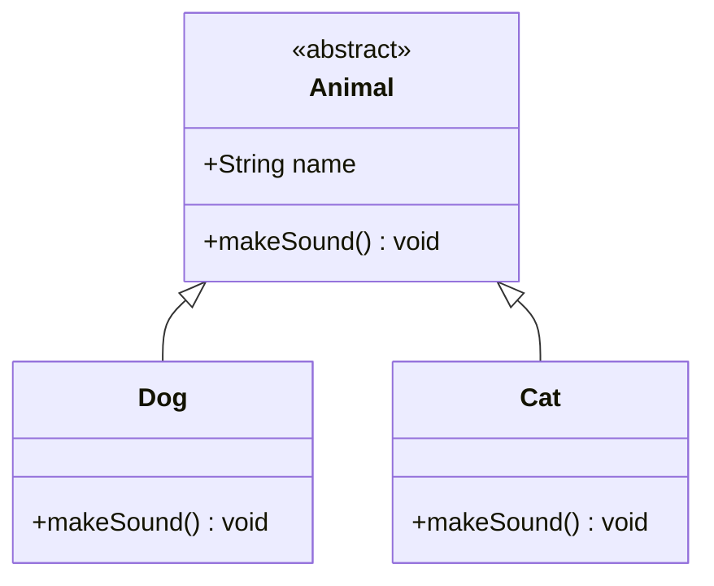
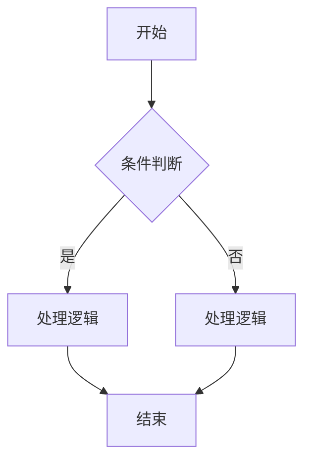
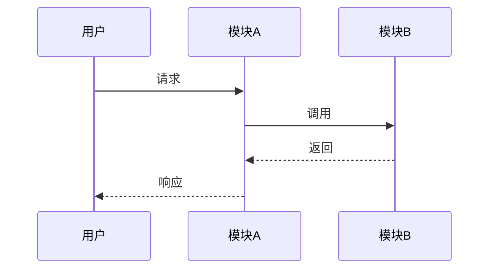

# 代码文档生成技能

## 核心能力

本技能让 AI 能够：
1. **阅读并理解源代码** - 分析代码结构、功能、依赖关系
2. **生成 Markdown 文档** - 结构化输出代码文档
3. **生成 Mermaid 图表** - 类图、流程图、时序图

## 输出格式规范

### Markdown 文档结构

```markdown
# [项目/模块名称]

## 概述
[简要说明这个代码是做什么的]

## 执行流程（伪代码）
[用中文伪代码描述代码的执行流程]
```
条件判断：如果 xxx
    ↓
处理分支：当 xxx 时执行 xxx
    ↓
循环逻辑：对 xxx 进行遍历处理
```

## 目录结构
[项目文件树]

## 核心模块
[按模块/文件组织，详细说明每个部分]

## API 参考
[接口、函数签名、参数说明]

## 类型定义
[interface、type、class 等类型定义]
```

### Mermaid 图表规范

#### 类图 (Class Diagram)
展示类、接口、继承、实现、依赖关系：



**识别要点：**
- `class` 关键字定义类
- `interface` 定义接口
- `<|--` 表示继承
- `<|..` 表示实现
- `-->` 表示依赖

#### 流程图 (Flowchart)
展示程序执行流程：



**识别要点：**
- `flowchart TD/BT/LR/RL` 定义方向（上下左右）
- `[ ]` 矩形：处理步骤
- `{ }` 菱形：条件判断
- `( )` 圆角矩形：开始/结束
- `-->` 箭头流向

#### 时序图 (Sequence Diagram)
展示对象间的调用顺序：



**识别要点：**
- `participant` 定义参与者
- `->>` 实线箭头：同步调用
- `-->>` 虚线箭头：返回
- `Note` 备注说明

## 工作流程

首先阅读源代码文件，理解代码的功能和结构。然后分析代码中的模块划分、类型定义、函数接口和依赖关系。最后根据分析结果生成 Markdown 格式的文档，并在文档中嵌入 Mermaid 图表来可视化展示类型关系、程序流程和调用顺序。

**读取代码时**，需要确定代码范围是单个文件还是整个项目，按依赖顺序读取所有相关文件，并记录每个文件的主要用途。

**分析代码时**，需要识别每个文件或目录的职责，找出导出的函数、类和接口，整理类型定义（interface、type、enum），理清 import 语句建立的依赖关系，并追踪函数之间的调用链。

**生成文档时**，按照概述、目录结构、核心模块、API 参考、类型定义等层级组织内容，代码块要标注语言类型便于语法高亮，用中文注释解释关键逻辑。

**生成图表时**，根据代码特点选择合适的展示方式：类型和关系用类图，业务逻辑用流程图，对象调用顺序用时序图。

## 示例

### 示例 1：单文件分析

**输入：**
用户要求分析一个 `auth.ts` 文件

**输出：**
```markdown
# 认证模块

## 概述
处理用户认证、注册、JWT token 管理

## 执行流程（伪代码）
```
用户提交登录请求
    ↓
验证用户名密码
    ↓
生成 JWT token
    ↓
返回 token 和用户信息
```

## 核心功能
- `login()` - 用户登录
- `register()` - 用户注册  
- `refreshToken()` - 刷新 token
- `logout()` - 退出登录

## 类型定义
```typescript
interface User {
  id: string;
  email: string;
  name: string;
}

interface AuthResponse {
  token: string;
  user: User;
}
```

## 流程图
[mermaid 流程图]

## 时序图
[mermaid 时序图]
```

### 示例 2：项目级分析

**输入：**
用户要求分析整个项目结构

**输出：**
```markdown
# 项目架构文档

## 概述
[项目简介]

## 目录结构
[完整目录树]

## 模块划分
[每个模块的职责说明]

## 类图
[mermaid 类图，展示核心类型关系]

## 执行流程（伪代码）
```
用户请求进入系统
    ↓
路由匹配模块
    ↓
权限校验
    ↓
业务处理
    ↓
数据访问层
    ↓
返回响应
```

## 调用流程
[mermaid 时序图，展示主要业务流程]
```

## 图表选择指南

| 场景 | 推荐图表 |
|------|----------|
| 了解类/接口结构 | 类图 |
| 理解程序执行逻辑 | 流程图 |
| 分析模块间调用 | 时序图 |
| 展示状态变化 | 状态图 |
| 表示决策分支 | 流程图 |

## 注意事项

1. **中文优先** - 文档和注释使用中文，便于理解
2. **图表简洁** - 复杂逻辑拆分为多个简单图表
3. **代码高亮** - 代码块指定语言类型
4. **层级清晰** - 使用标题层级组织内容
5. **实用为主** - 聚焦于帮助理解代码，而不是生成漂亮的文档

## 局限性

- 不会执行代码，只会静态分析
- 不会修改原始代码
- 对于运行时行为（如闭包、异步），只能基于代码推断
