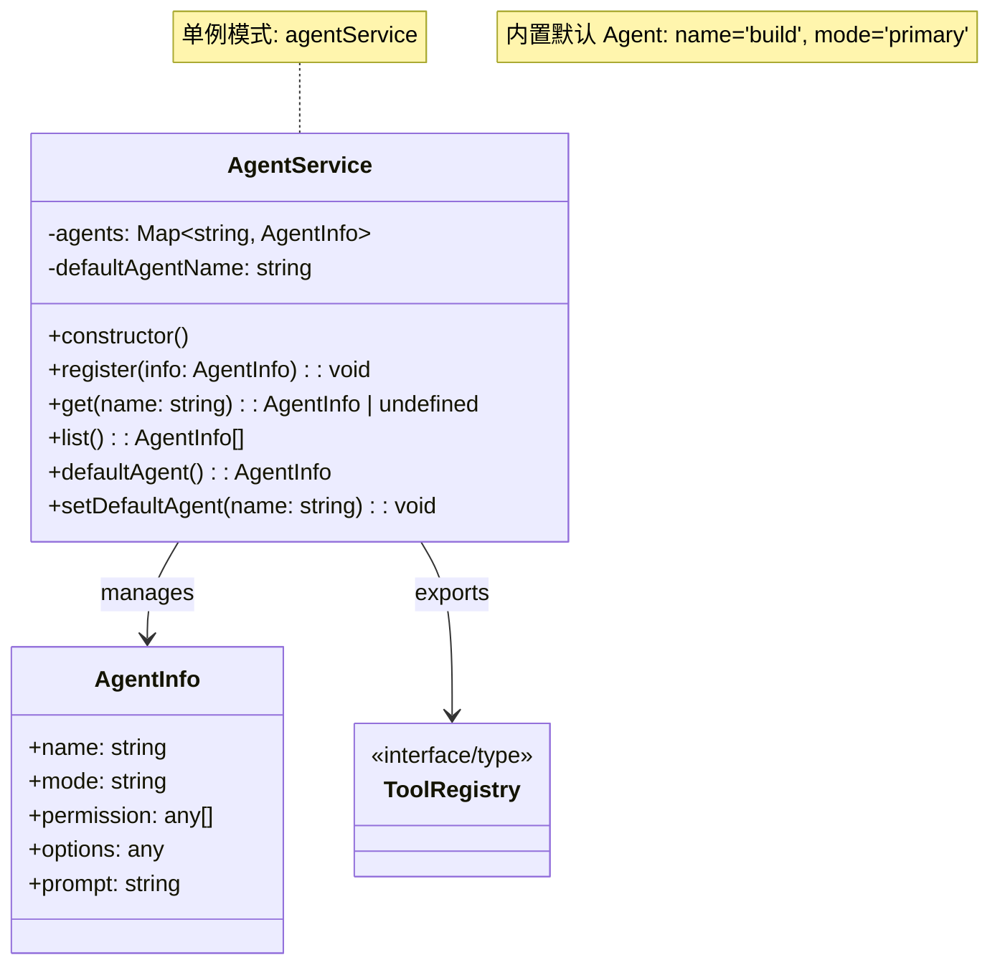

# Agent 模块文档

## 概述

`src/agent/agent.ts` 是 Agent 管理模块，负责：
- 内置默认 Agent (build)
- Agent 列表管理和获取
- 工具注册表导出

## 类图



## 核心组件

### 1. DEFAULT_BUILD_AGENT

内置默认 Agent 配置：

| 属性 | 值 | 说明 |
|------|-----|------|
| name | `"build"` | Agent 名称 |
| mode | `"primary"` | 运行模式 |
| permission | `[]` | 权限列表 |
| options | `{}` | 配置选项 |
| prompt | `""` | 提示词 |

### 2. AgentService 类

Agent 服务类，提供以下功能：

| 方法 | 说明 |
|------|------|
| `register(info: AgentInfo)` | 注册 Agent，已存在则替换并警告 |
| `get(name: string)` | 根据名称获取 Agent |
| `list()` | 获取所有 Agent 列表 |
| `defaultAgent()` | 获取默认 Agent |
| `setDefaultAgent(name: string)` | 设置默认 Agent |

### 3. 导出

- `agentService`: AgentService 单例实例
- `toolRegistry`: 工具注册表
- `ToolRegistry`: 工具注册表类型

## 数据流

```
注册 Agent
    ↓
AgentService.agents (Map<string, AgentInfo>)
    ↓
获取/列表操作
    ↓
返回 AgentInfo
```

## 依赖关系

- `AgentInfo` 类型 from `./types`
- `toolRegistry, ToolRegistry` from `./tool-registry`
- `Log` from `../log`
