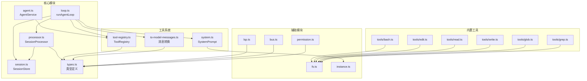
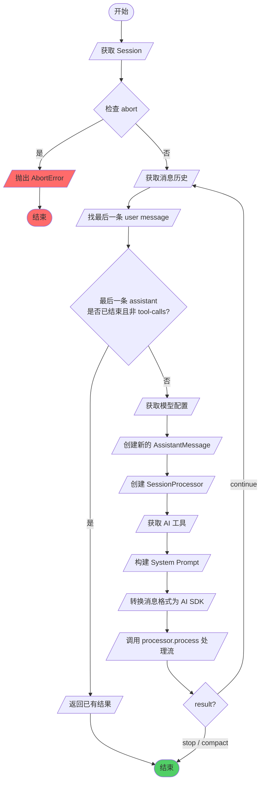
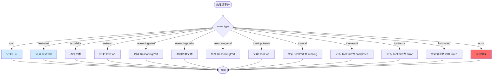
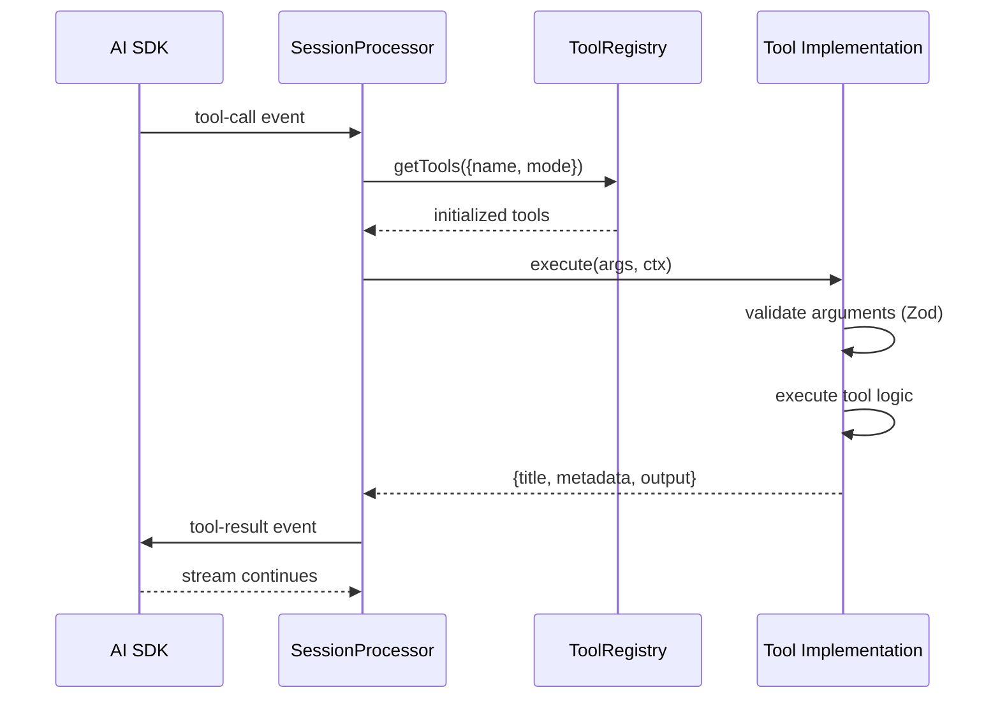
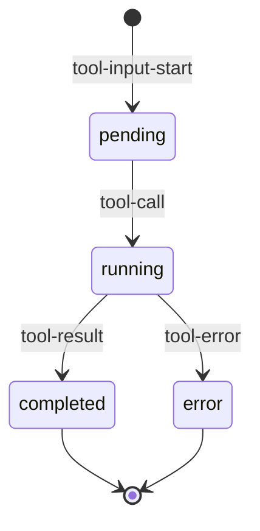
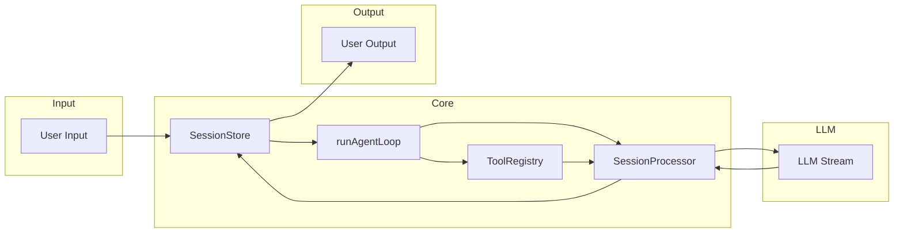

# Agent 模块架构文档

## 概述

Agent 模块是 Ts AI Coding Agent 的核心引擎，负责管理 AI 对话循环、处理工具调用、持久化会话状态。参考 opencode 的设计实现，采用了流式处理架构。

**核心职责：**
1. 管理 Agent 的注册和获取
2. 运行会话主循环 (Agent Loop)
3. 处理 LLM 流式响应事件
4. 管理会话和消息的内存存储
5. 注册和执行工具
6. 构建系统提示词

## 目录结构

```
src/agent/
├── agent.ts              # Agent 服务，管理和注册 agents
├── loop.ts               # 会话主循环，核心执行逻辑
├── processor.ts          # LLM 流事件处理器
├── session.ts            # 会话存储，内存存储管理
├── types.ts              # 核心类型定义
├── tool-registry.ts      # 工具注册表
├── to-model-messages.ts  # 消息格式转换为 AI SDK 格式
├── system.ts             # System Prompt 构建器
├── lsp.ts                # LSP 工具 (stub)
├── bus.ts                # 事件总线
├── permission.ts         # 权限管理 (stub)
├── fs.ts                 # 文件系统封装
├── instance.ts           # 实例信息
├── flag.ts               # 标志位工具
├── shell.ts              # Shell 工具
├── truncate.ts           # 截断工具
├── format.ts             # 格式化工具
├── lazy.ts               # 延迟加载工具
├── which.ts              # 命令查找工具
├── file-time.ts          # 文件时间工具
├── bash-arity.ts         # Bash 参数工具
├── assert-external-directory.ts  # 外部目录检查
├── plugin.ts             # 插件工具
└── tools/                # 内置工具集
    ├── bash.ts           # Bash 执行工具
    ├── edit.ts           # 文件编辑工具
    ├── read.ts           # 文件读取工具
    ├── write.ts          # 文件写入工具
    ├── glob.ts           # 文件匹配工具
    └── grep.ts           # 内容搜索工具
```

## 核心模块

### 1. Agent 服务 (agent.ts)

负责管理和注册 AI Agent。

```typescript
class AgentService {
  private agents: Map<string, AgentInfo> = new Map()
  private defaultAgentName = "build"
  
  register(info: AgentInfo): void
  get(name: string): AgentInfo | undefined
  list(): AgentInfo[]
  defaultAgent(): AgentInfo
  setDefaultAgent(name: string): void
}

export const agentService = new AgentService()
```

### 2. 会话主循环 (loop.ts)

核心执行循环，协调各个组件完成一次 AI 对话交互。

```typescript
export async function runAgentLoop(options: AgentLoopOptions): Promise<AgentLoopResult>
```

**循环流程：**
1. 获取 session
2. 检查 abort 信号
3. 重新获取消息历史
4. 找最后一条 user message
5. 检查是否需要退出
6. 获取模型
7. 创建新的 assistant message
8. 创建 processor
9. 获取工具
10. 构建 system prompt
11. 转换消息历史为 AI SDK 格式
12. 调用 processor.process() 处理流
13. 根据返回值决定继续或结束

### 3. 处理器 (processor.ts)

处理 LLM 流式事件，管理 Part 生命周期。

```typescript
export interface SessionProcessor {
  readonly message: AssistantMessage
  readonly partFromToolCall: (toolCallID: string) => ToolPart | undefined
  readonly handleEvent: (event: StreamEvent) => Effect.Effect<void>
  readonly getParts: () => Part[]
  readonly process: (input: StreamInput) => Promise<ProcessorResult>
}

export type StreamEvent =
  | { type: "start" }
  | { type: "reasoning-start"; id: string; ... }
  | { type: "reasoning-delta"; id: string; text: string; ... }
  | { type: "reasoning-end"; id: string; ... }
  | { type: "tool-input-start"; id: string; toolName: string; ... }
  | { type: "tool-input-delta"; id: string; text: string; ... }
  | { type: "tool-input-end"; id: string }
  | { type: "tool-call"; toolCallId: string; toolName: string; args: Record<string, unknown>; ... }
  | { type: "tool-result"; toolCallId: string; result: unknown; ... }
  | { type: "tool-error"; toolCallId: string; error: Error; ... }
  | { type: "error"; error: Error }
  | { type: "start-step" }
  | { type: "finish-step"; finishReason: "stop" | "tool-calls" | "unknown"; usage: {...}; ... }
  | { type: "text-start"; ... }
  | { type: "text-delta"; textDelta: string; ... }
  | { type: "text-end"; ... }
```

**ProcessorResult:**
- `stop` - 结束对话
- `continue` - 继续下一轮循环
- `compact` - 需要压缩上下文

### 4. 会话存储 (session.ts)

内存会话存储，管理所有会话和消息。

```typescript
class SessionStore {
  private sessions: Map<SessionID, Session> = new Map()
  private messageIndex: Map<MessageID, {...}> = new Map()
  private partIndex: Map<PartID, {...}> = new Map()
  
  create(cwd: string, root: string): Session
  get(id: SessionID): Session | undefined
  list(): Session[]
  delete(id: SessionID): boolean
  addMessage(sessionID: SessionID, info: UserMessage | AssistantMessage): Message
  getMessage(messageID: MessageID): Message | undefined
  updateMessage(sessionID: SessionID, info: Partial<AssistantMessage> & { id: MessageID }): void
  addPart(sessionID: SessionID, messageID: MessageID, part: Part): Part
  updatePart(sessionID: SessionID, part: Part): void
  getParts(messageID: MessageID): Part[]
  getMessagesWithParts(sessionID: SessionID): Message[]
  createAssistantMessage(...): AssistantMessage
  createUserMessage(...): UserMessage
}

export const sessionStore = new SessionStore()
```

### 5. 工具注册表 (tool-registry.ts)

管理所有可用工具的注册和初始化。

```typescript
class ToolRegistry {
  private tools: Map<string, ToolInfo> = new Map()
  private initializedTools: Map<string, Awaited<ReturnType<ToolInfo["init"]>>> = new Map()
  
  register(tool: ToolInfo): void
  ids(): string[]
  async getTools(agent?: { name: string; mode: string }): Promise<Array<{ id: string } & Awaited<...>>>
  getInitializedTool(id: string): Awaited<ReturnType<ToolInfo["init"]>> | undefined
}

export const toolRegistry = new ToolRegistry()
```

### 6. 消息转换 (to-model-messages.ts)

将内部消息格式转换为 AI SDK 的 ModelMessage 格式。

```typescript
export async function toModelMessages(
  input: WithParts[],
  model: Provider.Model,
  options?: ToModelMessagesOptions,
): Promise<ReturnType<typeof convertToModelMessages>>
```

### 7. Part 类型 (types.ts)

消息由多个 Part 组成：

```typescript
type Part = TextPart | ReasoningPart | ToolPart | FilePart | StepStartPart | StepFinishPart

interface TextPart {
  id: PartID
  sessionID: SessionID
  messageID: MessageID
  type: "text"
  text: string
  time?: { start: number; end?: number }
  metadata?: Record<string, unknown>
}

interface ReasoningPart {
  id: PartID
  sessionID: SessionID
  messageID: MessageID
  type: "reasoning"
  text: string
  time: { start: number; end?: number }
  metadata?: Record<string, unknown>
}

interface ToolPart {
  id: PartID
  sessionID: SessionID
  messageID: MessageID
  type: "tool"
  callID: string
  tool: string
  state: ToolState  // pending | running | completed | error
  metadata?: Record<string, unknown>
}

interface StepStartPart {
  id: PartID
  sessionID: SessionID
  messageID: MessageID
  type: "step-start"
  snapshot?: string
}

interface StepFinishPart {
  id: PartID
  sessionID: SessionID
  messageID: MessageID
  type: "step-finish"
  reason: string
  snapshot?: string
  cost: number
  tokens: {...}
}
```

## 架构图

### 类图

```mermaid
classDiagram
    class AgentService {
        -agents: Map~string, AgentInfo~
        -defaultAgentName: string
        +register(info: AgentInfo): void
        +get(name: string): AgentInfo | undefined
        +list(): AgentInfo[]
        +defaultAgent(): AgentInfo
        +setDefaultAgent(name: string): void
    }
    
    class SessionStore {
        -sessions: Map~SessionID, Session~
        -messageIndex: Map~MessageID, ...~
        -partIndex: Map~PartID, ...~
        +create(cwd: string, root: string): Session
        +get(id: SessionID): Session | undefined
        +addMessage(...): Message
        +updateMessage(...): void
        +addPart(...): Part
        +updatePart(...): void
        +getMessagesWithParts(sessionID: SessionID): Message[]
        +createAssistantMessage(...): AssistantMessage
    }
    
    class ToolRegistry {
        -tools: Map~string, ToolInfo~
        -initializedTools: Map~string, ...~
        +register(tool: ToolInfo): void
        +getTools(agent?: {...}): Promise~Array~...~~
        +getInitializedTool(id: string): Awaited~...~ | undefined
    }
    
    class SessionProcessor {
        -ctx: ProcessorContext
        -parts: Part[]
        +message: AssistantMessage
        +partFromToolCall(toolCallID: string): ToolPart | undefined
        +handleEvent(event: StreamEvent): Effect~void~
        +getParts(): Part[]
        +process(input: StreamInput): Promise~ProcessorResult~
    }
    
    class Part {
        <<union>>
    }
    
    class TextPart {
        +id: PartID
        +type: "text"
        +text: string
        +time?: {...}
    }
    
    class ReasoningPart {
        +id: PartID
        +type: "reasoning"
        +text: string
    }
    
    class ToolPart {
        +id: PartID
        +type: "tool"
        +tool: string
        +state: ToolState
    }
    
    class FilePart {
        +id: PartID
        +type: "file"
        +mime: string
        +url: string
    }
    
    class StepStartPart {
        +id: PartID
        +type: "step-start"
    }
    
    class StepFinishPart {
        +id: PartID
        +type: "step-finish"
        +reason: string
        +tokens: {...}
    }
    
    Part <|-- TextPart
    Part <|-- ReasoningPart
    Part <|-- ToolPart
    Part <|-- FilePart
    Part <|-- StepStartPart
    Part <|-- StepFinishPart
    
    AgentService --> ToolRegistry : uses
    SessionStore --> Session : manages
    SessionProcessor --> SessionStore : uses
    SessionProcessor --> ToolRegistry : gets tools from
    
    class Session {
        +id: SessionID
        +createdAt: number
        +updatedAt: number
        +messages: Message[]
        +cwd: string
        +root: string
    }
    
    class Message {
        +info: UserMessage | AssistantMessage
        +parts: Part[]
    }
    
    Session --> Message : contains
    Message --> Part : contains
```

### 模块依赖图



## 流程图

### Agent Loop 主流程



### Processor 流事件处理



### 工具执行流程



## 类型关系

### Message 类型层次

```mermaid
classDiagram
    class Message {
        <<interface>>
        info: UserMessage | AssistantMessage
        parts: Part[]
    }
    
    class UserMessage {
        +id: MessageID
        +sessionID: SessionID
        +role: "user"
        +time: {created: number}
        +agent: string
        +model: {providerID, modelID}
        +system?: string
        +tools?: Record~string, boolean~
    }
    
    class AssistantMessage {
        +id: MessageID
        +sessionID: SessionID
        +role: "assistant"
        +time: {created, completed?}
        +error?: ErrorInfo
        +parentID: MessageID
        +modelID: string
        +providerID: string
        +mode: string
        +agent: string
        +path: {cwd, root}
        +cost: number
        +tokens: {...}
        +finish?: string
    }
    
    Message o-- UserMessage
    Message o-- AssistantMessage
    Message o-- Part
```

### ToolState 状态机



## 数据流



## 关键设计

### 1. 内存存储

SessionStore 使用内存 Map 存储所有会话数据，消息通过索引快速访问。

### 2. Part 系统

消息由多个 Part 组成，支持增量更新（text-delta、reasoning-delta），便于流式渲染。

### 3. Effect 并发

使用 Effect 库处理异步流事件，支持中断和错误恢复。

### 4. 消息格式转换

toModelMessages 将内部格式转换为 AI SDK 格式，支持多种模型 provider。

## 参考

- OpenCode Agent 实现: `packages/opencode/src/agent/` 和 `packages/opencode/src/session/`
