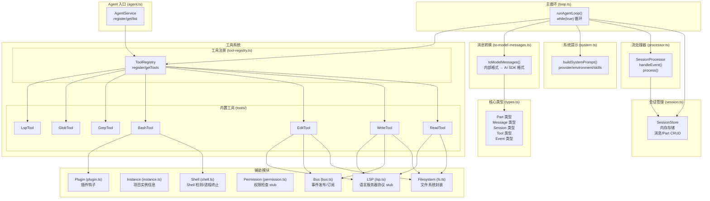
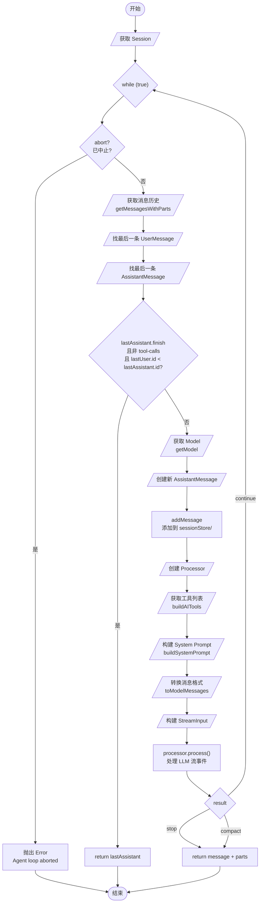

# src/agent 目录代码结构分析

## 1. 概述

`src/agent` 是 Ts AI Coding Agent 的核心模块，负责：
- **Agent 管理**：内置默认 agent (build) 的注册和获取
- **会话管理**：Session 消息历史和状态管理
- **主循环控制**：Agent 与 LLM 的交互循环
- **流式处理**：LLM 响应的流式事件处理
- **工具系统**：内置工具（read/write/edit/bash/grep/glob）的注册和执行
- **消息转换**：内部消息格式与 AI SDK 格式的转换

## 2. 架构图

### 2.1 模块依赖关系



### 2.2 类图

```mermaid
classDiagram
    class AgentService {
        -agents: Map~string, AgentInfo~
        -defaultAgentName: string
        +register(info: AgentInfo): void
        +get(name: string): AgentInfo | undefined
        +list(): AgentInfo[]
        +defaultAgent(): AgentInfo
        +setDefaultAgent(name: string): void
    }

    class SessionStore {
        -sessions: Map~SessionID, Session~
        -messageIndex: Map~MessageID, idx~
        -partIndex: Map~PartID, idx~
        +create(cwd, root): Session
        +get(id): Session | undefined
        +list(): Session[]
        +delete(id): boolean
        +addMessage(sessionID, info): Message
        +getMessage(messageID): Message | undefined
        +updateMessage(sessionID, info): void
        +addPart(sessionID, messageID, part): Part
        +updatePart(sessionID, part): void
        +getParts(messageID): Part[]
        +getMessagesWithParts(sessionID): Message[]
        +createAssistantMessage(...): AssistantMessage
        +createUserMessage(...): UserMessage
    }

    class ToolRegistry {
        -tools: Map~string, ToolInfo~
        -initializedTools: Map~string, initialized~
        +register(tool: ToolInfo): void
        +ids(): string[]
        +getTools(agent?): Promise~initialized[]~
        +getInitializedTool(id): initialized | undefined
    }

    class SessionProcessor {
        -ctx: ProcessorContext
        -parts: Part[]
        +message: AssistantMessage
        +partFromToolCall(toolCallID): ToolPart | undefined
        +handleEvent(event): Effect~void~
        +getParts(): Part[]
        +process(input): Promise~ProcessorResult~
    }

    class BusClass {
        -handlers: Map~string, Set~EventHandler~~
        +publish(event, data): void
        +subscribe(event, handler): EventSubscription
    }

    class ToolInfo~Parameters, M~ {
        +id: string
        +init: (ctx?) => Promise~{description, parameters, execute}~
    }

    class ToolContext {
        +sessionID: SessionID
        +messageID: MessageID
        +agent: string
        +abort: AbortSignal
        +callID?: string
        +messages: Message[]
        +metadata(): Promise~void~
        +ask(): Promise~void~
    }

    ToolRegistry --> ToolInfo
    ToolInfo ..> ToolContext : execute(ctx)
    SessionProcessor --> SessionStore
```

## 3. 核心类型体系

```mermaid
classDiagram
    class Part {
        <<union>>
    }

    class TextPart {
        +id: PartID
        +sessionID: SessionID
        +messageID: MessageID
        +type: "text"
        +text: string
        +synthetic?: boolean
        +ignored?: boolean
    }

    class ReasoningPart {
        +id: PartID
        +type: "reasoning"
        +text: string
        +time: {start, end?}
    }

    class ToolPart {
        +id: PartID
        +callID: string
        +tool: string
        +state: ToolState
    }

    class FilePart {
        +id: PartID
        +type: "file"
        +mime: string
        +url: string
    }

    class StepStartPart {
        +id: PartID
        +type: "step-start"
    }

    class StepFinishPart {
        +id: PartID
        +type: "step-finish"
        +reason: string
        +cost: number
        +tokens: TokenCount
    }

    class ToolState {
        <<union>>
    }

    class ToolStatePending {
        +status: "pending"
        +input: Record
        +raw: string
    }

    class ToolStateRunning {
        +status: "running"
        +input: Record
        +time: {start}
    }

    class ToolStateCompleted {
        +status: "completed"
        +output: string
        +title: string
        +time: {start, end}
        +attachments?: FilePart[]
    }

    class ToolStateError {
        +status: "error"
        +error: string
        +time: {start, end}
    }

    Part <|-- TextPart
    Part <|-- ReasoningPart
    Part <|-- ToolPart
    Part <|-- FilePart
    Part <|-- StepStartPart
    Part <|-- StepFinishPart
    ToolState <|-- ToolStatePending
    ToolState <|-- ToolStateRunning
    ToolState <|-- ToolStateCompleted
    ToolState <|-- ToolStateError
```

## 4. 主流程图

### 4.1 Agent Loop 完整流程



### 4.2 Processor 事件处理流程

```mermaid
flowchart TD
    Start([开始]) --> Input[/StreamInput/]
    Input --> CreateContext[/创建 ProcessorContext/]
    CreateContext --> StreamStart["Stream.process()<br/>处理流事件"]
    
    StreamStart --> Event{event type}
    
    Event -->|start| LogStart[log: stream started]
    Event -->|reasoning-start| CreateReasoning[创建 ReasoningPart<br/>添加到 parts]
    Event -->|reasoning-delta| UpdateReasoning[更新 text<br/>累加 delta]
    Event -->|reasoning-end| FinishReasoning[设置 end time<br/>删除 from map]
    
    Event -->|tool-input-start| CreateToolPart[创建 ToolPart<br/>状态 pending<br/>添加到 parts]
    Event -->|tool-input-delta| LogDelta[log: tool input delta]
    Event -->|tool-input-end| LogEnd[log: tool input end]
    
    Event -->|tool-call| UpdateToolCall[更新状态 running<br/>记录 input]
    Event -->|tool-result| CompleteTool[更新状态 completed<br/>记录 output<br/>删除 from map]
    Event -->|tool-error| ErrorTool[更新状态 error<br/>记录 error message]
    
    Event -->|start-step| CreateStepStart[创建 StepStartPart]
    Event -->|finish-step| CreateStepFinish[创建 StepFinishPart<br/>更新 finishReason<br/>更新 tokens]
    
    Event -->|text-start| CreateText[创建 TextPart<br/>添加到 parts]
    Event -->|text-delta| UpdateText[累加 text delta]
    Event -->|text-end| FinishText[设置 end time<br/>trim text]
    
    Event -->|error| ThrowError[throw error]
    Event -->|unknown| LogWarn[log: unknown event]
    
    CreateReasoning --> CheckBreak{needsCompaction<br/>or shouldBreak?}
    UpdateReasoning --> CheckBreak
    FinishReasoning --> CheckBreak
    CreateToolPart --> CheckBreak
    UpdateToolCall --> CheckBreak
    CompleteTool --> CheckBreak
    ErrorTool --> CheckBreak
    CreateStepStart --> CheckBreak
    CreateStepFinish --> CheckBreak
    CreateText --> CheckBreak
    UpdateText --> CheckBreak
    FinishText --> CheckBreak
    LogStart --> CheckBreak
    LogDelta --> CheckBreak
    LogEnd --> CheckBreak
    LogWarn --> CheckBreak
    
    CheckBreak -->|否| StreamStart
    CheckBreak -->|是| Cleanup[/cleanup()<br/>清理资源/]
    
    Cleanup --> ReturnResult{返回结果}
    ReturnResult -->|"compact"| RCompact[return "compact"]
    ReturnResult -->|"stop"| RStop[return "stop"]
    ReturnResult -->|"continue"| RContinue[return "continue"]
    
    ThrowError --> CatchError[catchAllCause]
    CatchError --> Cleanup
```

### 4.3 工具执行流程

```mermaid
flowchart TD
    Start([LLM 请求工具]) --> BuildCtx[/构建 ToolContext/]
    BuildCtx --> CallExecute["t.execute(args, ctx)"]
    CallExecute --> ToolStart[/工具开始执行/]
    
    ToolStart --> CheckPermission{权限检查<br/>ctx.ask()}
    CheckPermission -->|拒绝| ThrowReject[抛出<br/>PermissionRejectedError]
    CheckPermission -->|允许| ExecuteTool
    
    ExecuteTool --> ToolSpecific{Switch tool type}
    
    ToolSpecific -->|Read| ReadFile[读取文件/目录<br/>返回文本/二进制/图片]
    ToolSpecific -->|Write| WriteFile[写入文件<br/>触发 Bus 事件]
    ToolSpecific -->|Edit| EditFile[编辑文件<br/>支持多种匹配策略]
    ToolSpecific -->|Bash| RunBash[执行 Shell 命令<br/>支持超时/中止]
    ToolSpecific -->|Grep| RunGrep[使用 ripgrep 搜索]
    ToolSpecific -->|Glob| RunGlob[模式匹配文件]
    ToolSpecific -->|LSP| RunLSP[LSP 操作<br/>goToDefinition 等]
    
    ReadFile --> PostProcess[后处理<br/>touchFile<br/>FileTime.read]
    WriteFile --> PostProcess
    EditFile --> PostProcess
    RunBash --> PostProcess
    RunGrep --> PostProcess
    RunGlob --> PostProcess
    RunLSP --> PostProcess
    
    PostProcess --> CheckDiag{有 LSP 诊断?}
    CheckDiag -->|是| ReturnDiag[返回结果<br/>包含 diagnostics]
    CheckDiag -->|否| ReturnResult[返回结果]
    
    ReturnDiag --> End([工具执行完成])
    ReturnResult --> End
    
    ThrowReject --> End
```

## 5. 文件清单

| 文件 | 行数 | 功能 |
|------|------|------|
| **agent.ts** | 81 | Agent 服务，工具注册表导出 |
| **types.ts** | 523 | 核心类型定义 (Part/Message/Session/Tool/Event) |
| **session.ts** | 331 | SessionStore 内存存储实现 |
| **loop.ts** | 221 | runAgentLoop 主循环 |
| **processor.ts** | 629 | SessionProcessor 流处理器 |
| **system.ts** | 116 | System Prompt 构建器 |
| **to-model-messages.ts** | 308 | 消息格式转换器 |
| **tool-registry.ts** | 70 | 工具注册表 |
| **plugin.ts** | 27 | 插件钩子系统 stub |
| **bus.ts** | 49 | 事件总线 |
| **instance.ts** | 34 | 项目实例信息 |
| **permission.ts** | 66 | 权限检查 stub |
| **fs.ts** | 152 | 文件系统封装 (Bun API) |
| **lsp.ts** | 210 | LSP stub 实现 |
| **shell.ts** | 82 | Shell 检测和进程终止 |
| **tools/read.ts** | 326 | Read 工具 |
| **tools/write.ts** | 100 | Write 工具 |
| **tools/edit.ts** | 634 | Edit 工具 (多种匹配策略) |
| **tools/bash.ts** | 293 | Bash 工具 |
| **tools/grep.ts** | 250 | Grep 工具 |
| **tools/glob.ts** | 169 | Glob 工具 |
| **tools/descriptions/*.ts** | - | 工具描述文本 |

## 6. 数据流

```mermaid
flowchart LR
    subgraph "外部"
        User[User Input]
        LLM[LLM API]
    end

    subgraph "agent module"
        subgraph "输入处理"
            UM[UserMessage]
        end
        
        subgraph "Agent Loop"
            AM1[AssistantMessage]
            Proc[Processor]
            SysPrompt[System Prompt]
            Tools[AI Tools]
        end
        
        subgraph "会话存储"
            Store[SessionStore]
            Msgs[Messages + Parts]
        end
        
        subgraph "工具系统"
            Registry[ToolRegistry]
            ToolDefs[Tool Definitions]
        end
        
        subgraph "输出处理"
            AM2[AssistantMessage]
            Parts[Parts[]]
        end
    end

    User --> UM
    UM --> Store
    Store --> Msgs
    Msgs --> ToModel[toModelMessages]
    UM --> FindLast[找最后一条 User]
    FindLast --> AM1
    AM1 --> Store
    Store --> Loop
    Loop --> Proc
    Loop --> SysPrompt
    Loop --> Registry
    Registry --> ToolDefs
    ToolDefs --> Tools
    Tools --> ToAI["AI SDK 格式"]
    ToModel --> ModelMsgs
    ToAI --> StreamIn[StreamInput]
    StreamIn --> Proc
    Proc <--> LLM
    Proc --> AM2
    Proc --> Parts
    Parts --> Store
```

## 7. 关键设计

### 7.1 Effect 错误处理

Processor 使用 `effect` 库的 `Effect.gen` 和 `Stream.tap` 处理异步流事件：

```typescript
Stream.runDrain(
  Stream.takeUntil(
    Stream.tap(
      Stream.fromAsyncIterable(rawEventStream, ...),
      (event) => Effect.gen(function* () {
        ctx.abort.throwIfAborted()
        yield* handleEvent(event)
      })
    ),
    () => ctx.needsCompaction || ctx.shouldBreak
  )
)
```

### 7.2 Part 生命周期

| 阶段 | 创建 | 更新 | 完成 |
|------|------|------|------|
| TextPart | text-start | text-delta | text-end |
| ReasoningPart | reasoning-start | reasoning-delta | reasoning-end |
| ToolPart | tool-input-start | tool-call | tool-result / tool-error |
| StepPart | start-step | - | finish-step |

### 7.3 循环退出条件

1. `abort.aborted === true` → 抛出错误
2. `result === "stop"` → 返回结果
3. `result === "compact"` → 返回结果（需要压缩）
4. `lastAssistant.finish` 非空且非 `tool-calls` → 返回结果
