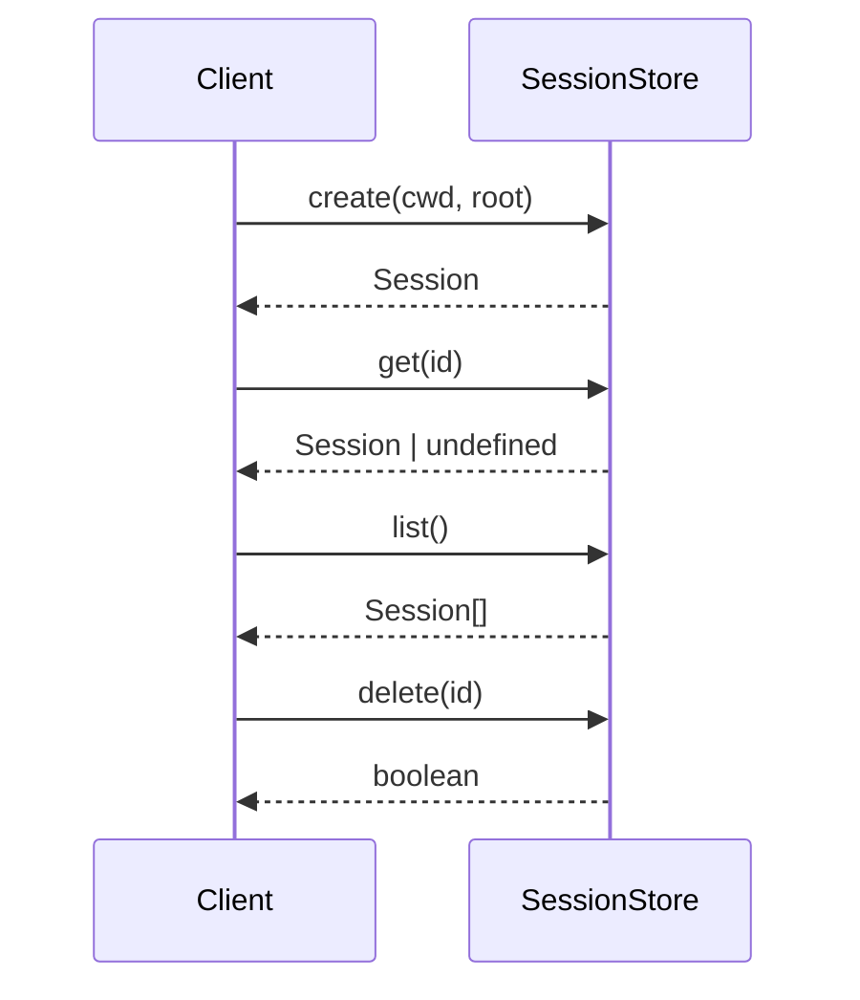
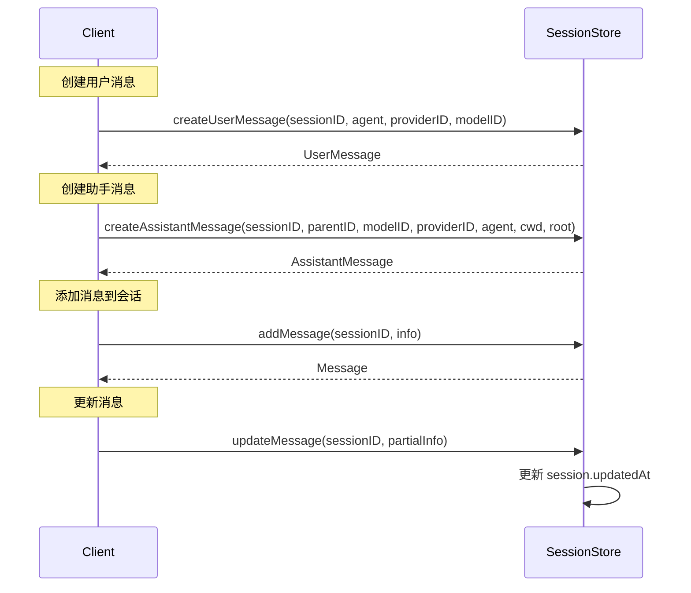
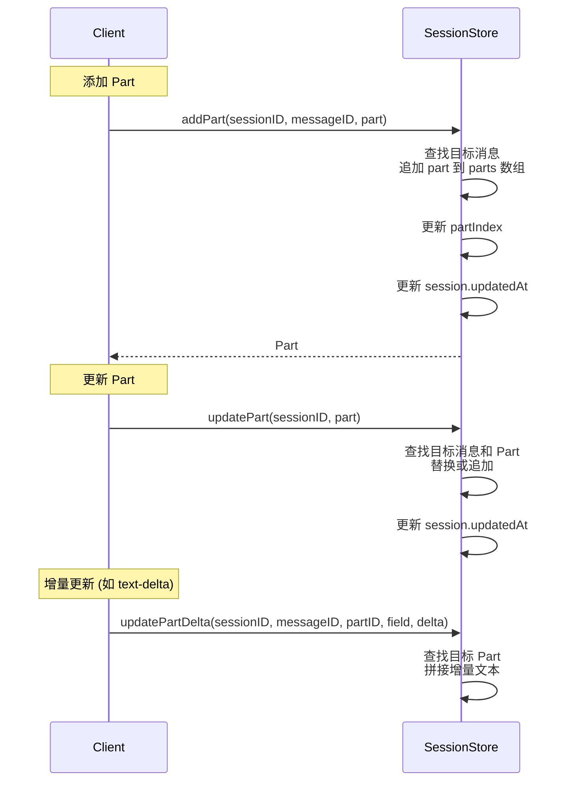
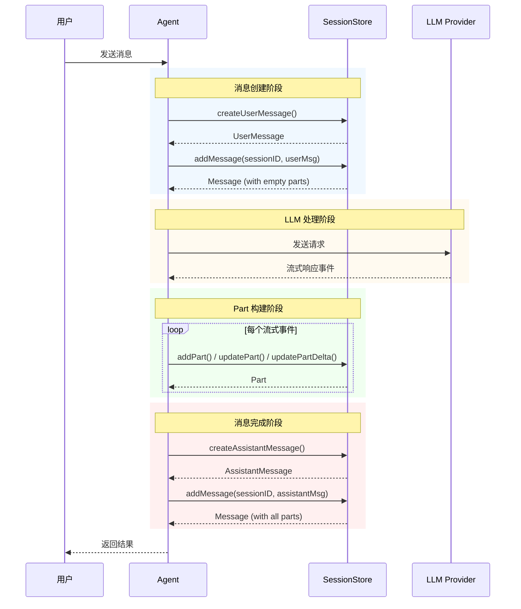

# Session 模块执行流程分析

## 概述

`src/agent/session.ts` 是会话管理器的核心实现，完全参考 opencode 的设计模式。该模块负责管理 AI 编程助手的会话状态、消息历史和 Parts 流转。

## 核心组件

### 1. SessionStore (会话存储管理器)

```typescript
export class SessionStore {
  private sessions: Map<SessionID, Session> = new Map()
  private messageIndex: Map<MessageID, { sessionID: SessionID; index: number }> = new Map()
  private partIndex: Map<PartID, { sessionID: SessionID; messageID: MessageID; index: number }> = new Map()
}
```

**职责**：
- 内存存储所有会话数据
- 维护消息和 Part 的快速索引
- 提供会话、消息、Part 的 CRUD 操作

### 2. 数据结构

```
Session
├── id: SessionID
├── createdAt: number
├── updatedAt: number
├── messages: Message[]
├── cwd: string
└── root: string

Message
├── info: UserMessage | AssistantMessage
└── parts: Part[]

Part (联合类型)
├── TextPart      - 文本输出
├── ReasoningPart - 思考过程
├── ToolPart      - 工具调用
├── FilePart      - 文件引用
├── StepStartPart - 步骤开始
└── StepFinishPart - 步骤完成
```

## 执行流程

### 会话生命周期



### 消息处理流程



### Part 处理流程



### 完整对话交互时序



## 核心操作详解

### 1. 会话创建 (`create`)

```typescript
create(cwd: string, root: string): Session
```

1. 生成唯一 SessionID
2. 创建 Session 对象（初始化空消息数组）
3. 存储到 `sessions` Map
4. 记录日志

### 2. 消息添加 (`addMessage`)

```typescript
addMessage(sessionID: SessionID, info: UserMessage | AssistantMessage): Message
```

1. 验证会话存在
2. 创建 Message 对象（包含 info 和空 parts 数组）
3. 记录消息索引：`messageIndex.set(info.id, { sessionID, index })`
4. 更新 `session.updatedAt`

### 3. Part 添加 (`addPart`)

```typescript
addPart(sessionID: SessionID, messageID: MessageID, part: Part): Part
```

1. 查找目标消息
2. 追加 part 到 `msg.parts`
3. 记录 Part 索引：`partIndex.set(part.id, { sessionID, messageID, index })`
4. 更新 `session.updatedAt`

### 4. 增量更新 (`updatePartDelta`)

```typescript
updatePartDelta(sessionID: SessionID, messageID: MessageID, partID: PartID, field: string, delta: string): void
```

用于流式场景下的增量文本更新：
- 查找目标 Part
- 对 `text` 或 `reasoning` 类型执行 `textPart.text += delta`

## 索引机制

SessionStore 维护三级索引以保证快速查询：

| 索引名 | 类型 | 用途 |
|--------|------|------|
| `sessions` | `Map<SessionID, Session>` | O(1) 会话查找 |
| `messageIndex` | `Map<MessageID, {sessionID, index}>` | O(1) 消息查找 |
| `partIndex` | `Map<PartID, {sessionID, messageID, index}>` | O(1) Part 查找 |

## 错误处理

| 操作 | 错误情况 |
|------|----------|
| `get()` | 会话不存在返回 `undefined` |
| `addMessage()` | 会话不存在抛出 `Error` |
| `addPart()` | 会话/消息不存在抛出 `Error` |
| `updatePart()` | 会话不存在静默返回 |

## 全局导出

```typescript
export const sessionStore = new SessionStore()

export function generatePartID(): PartID
export function generateMessageID(): MessageID
```

## 与 opencode 的对应关系

| 本模块 | opencode 源码 |
|--------|---------------|
| `session.ts` | `packages/opencode/src/session/*.ts` |
| `types.ts` | `packages/opencode/src/session/message-v2.ts` |
| `ToolPart/ToolState` | `packages/opencode/src/session/message-v2.ts` |

## 使用示例

```typescript
import { sessionStore, generatePartID, generateMessageID } from "./session"

// 1. 创建会话
const session = sessionStore.create("/project", "/project")

// 2. 创建用户消息
const userMsg = sessionStore.createUserMessage(session.id, "agent", "provider", "model")

// 3. 添加用户消息
const userMsgRef = sessionStore.addMessage(session.id, userMsg)

// 4. 创建助手消息
const assistantMsg = sessionStore.createAssistantMessage(
  session.id, userMsg.id, "model", "provider", "agent", "/project", "/project"
)

// 5. 添加助手消息
const assistantMsgRef = sessionStore.addMessage(session.id, assistantMsg)

// 6. 添加 Parts
const textPart: TextPart = {
  id: generatePartID(),
  sessionID: session.id,
  messageID: assistantMsg.id,
  type: "text",
  text: "Hello"
}
sessionStore.addPart(session.id, assistantMsg.id, textPart)

// 7. 增量更新
sessionStore.updatePartDelta(session.id, assistantMsg.id, textPart.id, "text", " World")
```
