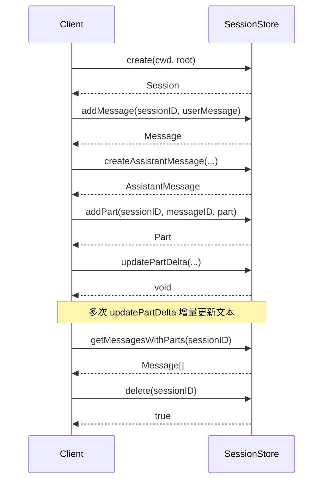
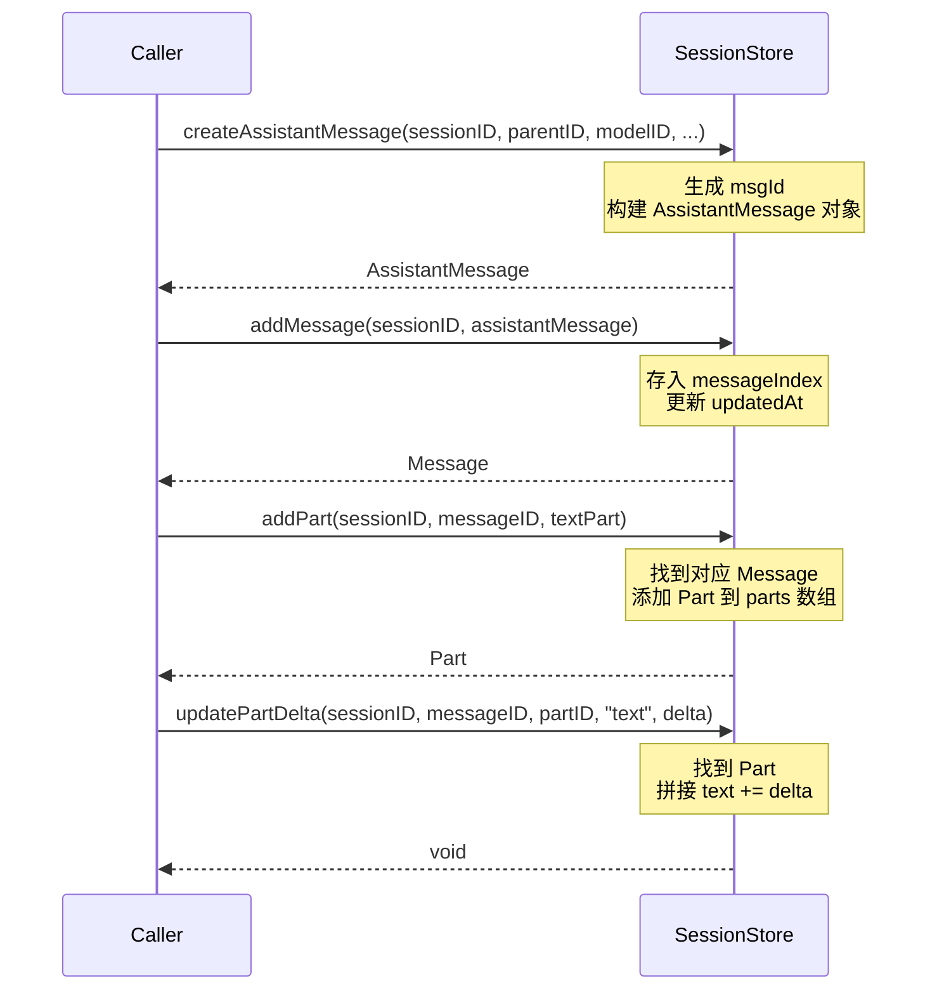
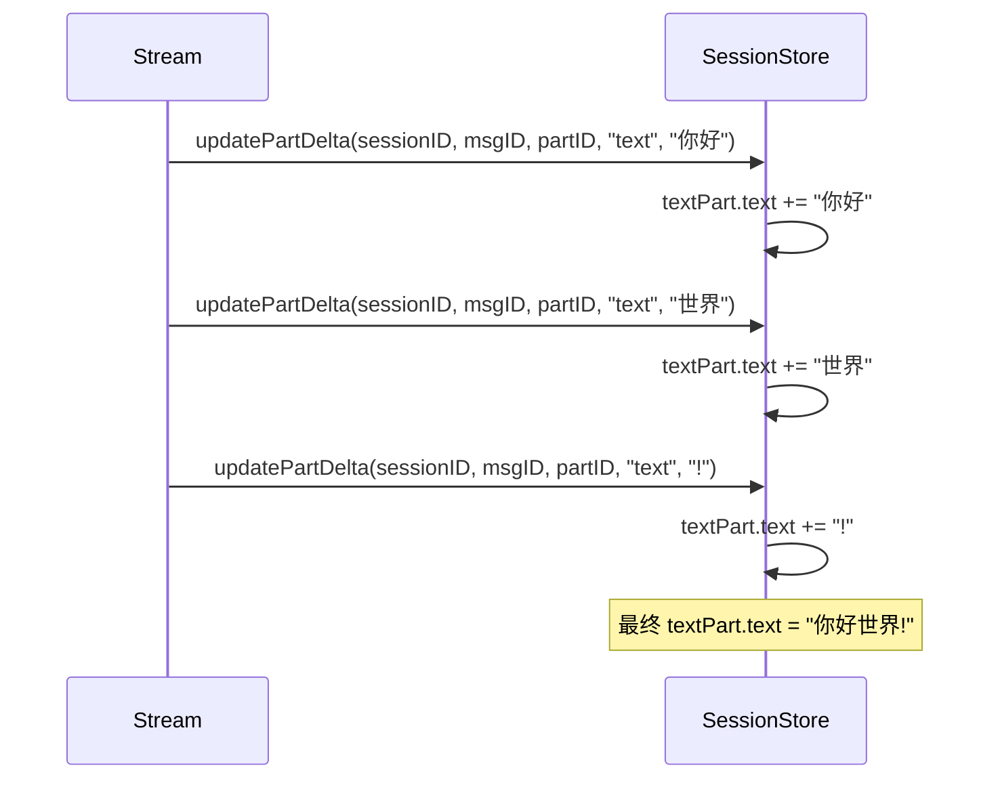

# Session 模块执行流程文档

## 概述

`src/agent/session.ts` 是会话管理模块，负责管理 AI 编程助手的会话、消息和 Parts 的内存存储。完全参考 opencode 的实现。

---

## 核心组件

| 组件 | 说明 |
|------|------|
| `SessionStore` | 内存会话存储类，管理所有会话和消息 |
| `sessionStore` | 全局单例实例 |
| `generatePartID()` | PartID 生成函数 |
| `generateMessageID()` | MessageID 生成函数 |

---

## 数据模型

### Session（会话）

```typescript
interface Session {
  id: SessionID           // 会话唯一标识
  createdAt: number       // 创建时间戳
  updatedAt: number       // 更新时间戳
  messages: Message[]     // 消息列表
  cwd: string             // 当前工作目录
  root: string            // 根目录
}
```

### Message（消息）

```typescript
interface Message {
  info: UserMessage | AssistantMessage  // 消息信息
  parts: Part[]                         // 消息包含的 Parts
}
```

### Part 类型

| 类型 | 说明 |
|------|------|
| `TextPart` | 文本内容 |
| `ReasoningPart` | 推理过程 |
| `ToolPart` | 工具执行结果 |
| `StepStartPart` | 步骤开始 |
| `StepFinishPart` | 步骤结束 |
| `FilePart` | 文件操作 |

---

## 索引结构

SessionStore 维护两个索引用于快速查找：

```typescript
// MessageID -> { sessionID, index }
private messageIndex: Map<MessageID, { sessionID: SessionID; index: number }>

// PartID -> { sessionID, messageID, index }
private partIndex: Map<PartID, { sessionID: SessionID; messageID: MessageID; index: number }>
```

---

## 执行流程时序图

### 1. 会话生命周期



### 2. 消息创建与 Part 添加流程



### 3. 增量文本更新流程



---

## API 参考

### 会话管理

#### `create(cwd: string, root: string): Session`
创建新会话，返回包含 id、创建/更新时间、初始空消息列表的 Session 对象。

#### `get(id: SessionID): Session | undefined`
根据会话 ID 获取会话，不存在返回 undefined。

#### `list(): Session[]`
返回所有会话，按 updatedAt 降序排列。

#### `delete(id: SessionID): boolean`
删除会话及其所有消息的索引，返回是否成功。

### 消息管理

#### `addMessage(sessionID: SessionID, info: UserMessage | AssistantMessage): Message`
添加消息到会话，同时建立 messageIndex 索引。

#### `getMessage(messageID: MessageID): Message | undefined`
通过索引快速获取消息。

#### `updateMessage(sessionID: SessionID, info: Partial<AssistantMessage> & { id: MessageID }): void`
更新消息信息（如 cost、tokens 等）。

#### `createAssistantMessage(...): AssistantMessage`
创建新的 AssistantMessage 对象，包含完整的结构初始化。

#### `createUserMessage(...): UserMessage`
创建新的 UserMessage 对象。

### Part 管理

#### `addPart(sessionID: SessionID, messageID: MessageID, part: Part): Part`
添加 Part 到指定消息，建立 partIndex 索引。

#### `updatePart(sessionID: SessionID, part: Part): void`
更新 Part，如果 Part 不存在则添加。

#### `updatePartDelta(sessionID, messageID, partID, field, delta): void`
增量更新字段，目前主要用于 text 和 reasoning 类型的增量拼接。

#### `getParts(messageID: MessageID): Part[]`
获取消息的所有 Parts。

#### `getMessagesWithParts(sessionID: SessionID): Message[]`
获取会话的所有消息（包含 Parts）。

---

## 文件位置

- 源文件: `src/agent/session.ts`
- 相关类型: `src/agent/types.ts`
- 相关 ID: `src/types/id.ts`
