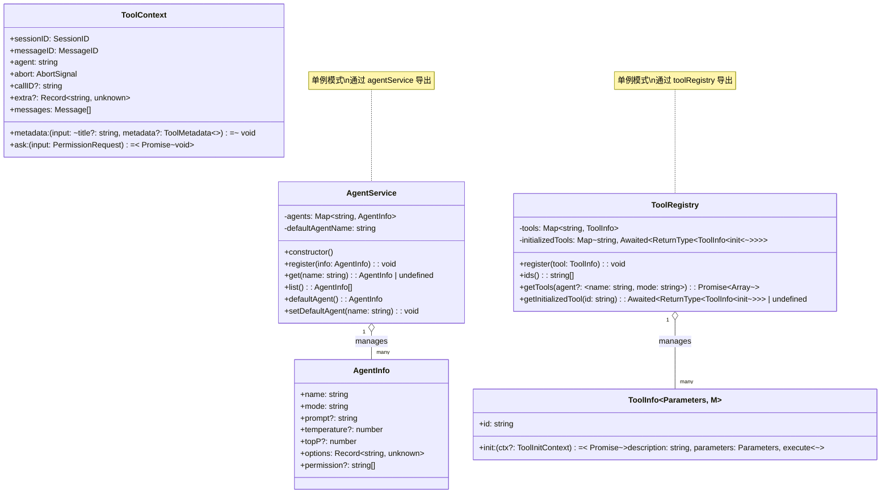
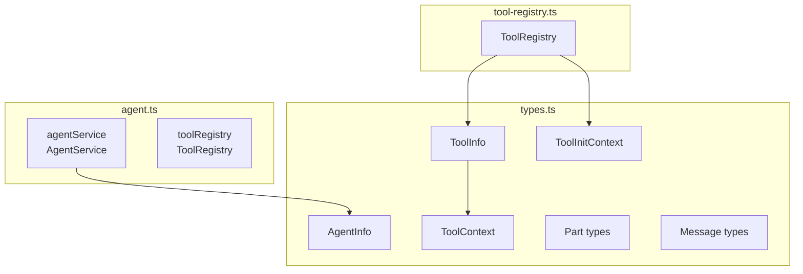

# Agent 模块文档

## 概述

`src/agent/agent.ts` 是 Agent 管理模块，负责管理 AI 编程助手中的 Agent（代理）实例和工具注册表。

**参考实现**: `opencode/packages/opencode/src/agent/agent.ts`

## 核心职责

1. **内置默认 Agent** - 提供一个名为 `build` 的默认 Agent
2. **Agent 注册与获取** - 管理多个 Agent 的注册、查询、列表
3. **工具注册表导出** - 对外暴露 `toolRegistry` 统一工具管理

## 类图



## 组件关系



## 执行流程（伪代码）

### Agent 注册流程

```
触发条件：模块初始化

执行操作：
1. 创建 AgentService 单例
2. 构造时自动注册 DEFAULT_BUILD_AGENT:
   - name = "build"
   - mode = "primary"
   - permission = []
   - options = {}
   - prompt = ""
3. 导出 agentService 供外部使用
```

### Agent 查询流程

```
触发条件：外部调用 agentService.get(name)

执行操作：
1. 在 agents Map 中以 name 为 key 查找
2. 找到则返回 AgentInfo，找不到返回 undefined

触发条件：外部调用 agentService.list()

执行操作：
1. 将 agents Map 转为数组
2. 返回所有已注册的 AgentInfo 列表
```

### 工具注册流程

```
触发条件：外部调用 toolRegistry.register(tool)

执行操作：
1. 检查 tool.id 是否已存在
   - 已存在：记录警告日志，替换旧工具
2. 将 tool 存入 tools Map
3. 从 initializedTools 中删除该 id（下次使用时重新初始化）
```

### 工具获取流程

```
触发条件：外部调用 toolRegistry.getTools(agent?)

执行操作：
1. 创建空数组 result
2. 遍历 tools Map 中的每个 tool:
   a. 检查该 tool 是否已初始化（initializedTools 中有缓存）
   b. 未初始化：
      - 调用 tool.init({ agent }) 初始化
      - 将结果存入 initializedTools 缓存
      - 出错则抛出错误
   c. 已初始化：直接使用缓存
   d. 将 { id, ...initialized } 推入 result
3. 返回 result 数组
```

## 关键类型

| 类型 | 说明 |
|------|------|
| `AgentInfo` | Agent 配置信息，包含名称、模式、权限等 |
| `ToolInfo` | 工具定义，包含初始化函数和执行函数 |
| `ToolContext` | 工具执行时的上下文环境 |
| `Part` | 消息中的各个部分（文本、思考、工具调用等） |
| `Message` | 消息（用户消息或助手消息） |
| `Session` | 会话，管理消息历史和状态 |

## 导出内容

```typescript
// 从 agent.ts 导出
export const agentService: AgentService
export { toolRegistry }
export type { ToolRegistry }

// 从 types.ts 导出（通过 agent.ts 子模块）
export type { 
  AgentInfo,
  ToolInfo,
  Tool,
  ToolContext,
  ToolInitContext,
  Part,
  Message,
  Session,
  // ... 其他类型
}
```

## 与 opencode 的差异

> 本实现为简化版本，核心 API 保持一致

| 特性 | opencode | 本实现 |
|------|----------|--------|
| Agent 数量 | 多个可配置 | 内置默认 build |
| Agent 配置 | 支持自定义 | 简化版，仅注册/获取 |
| 工具注册 | 完整实现 | 完整实现 |
