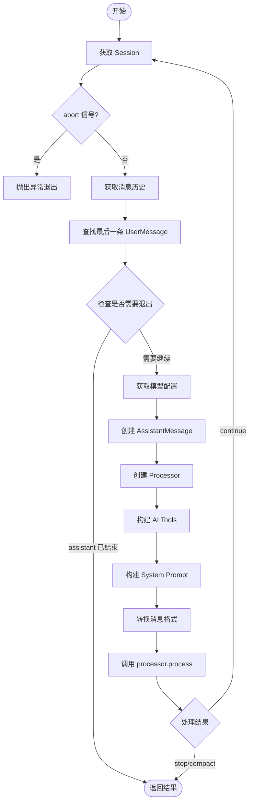
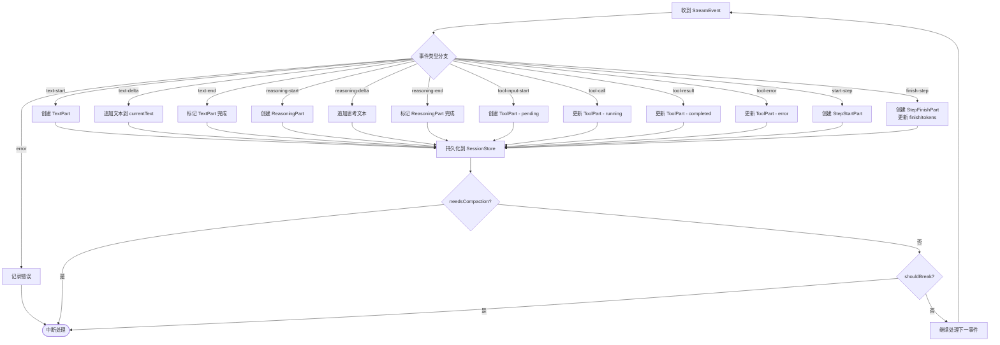
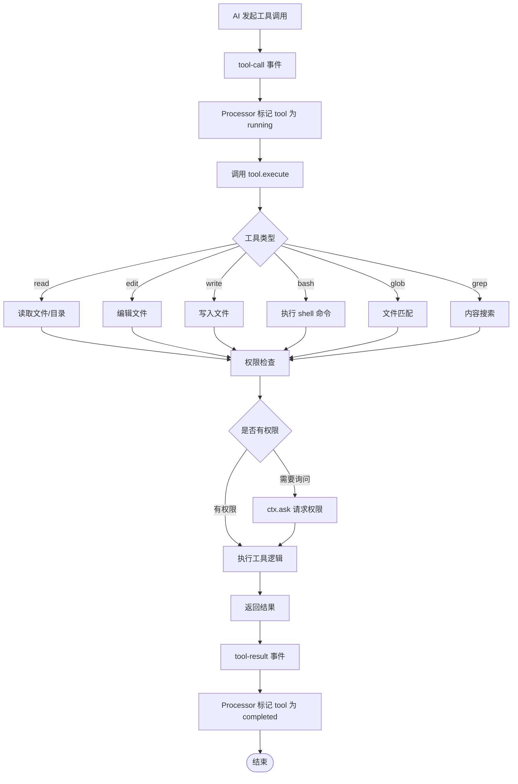
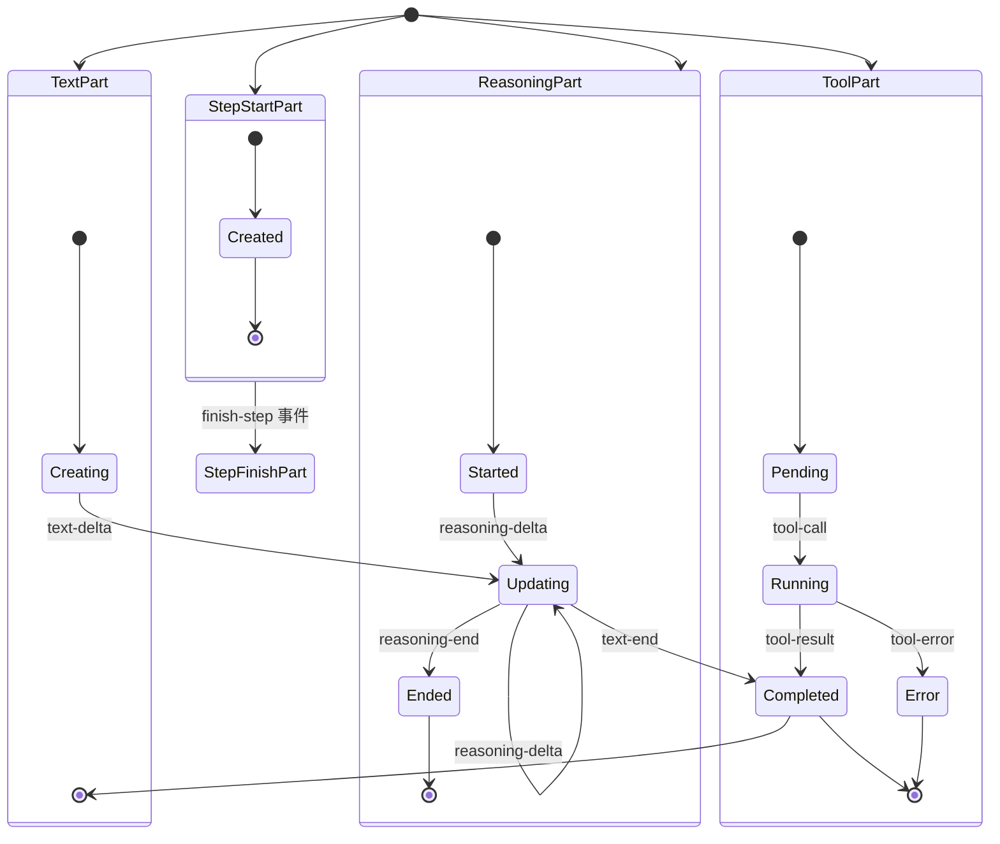
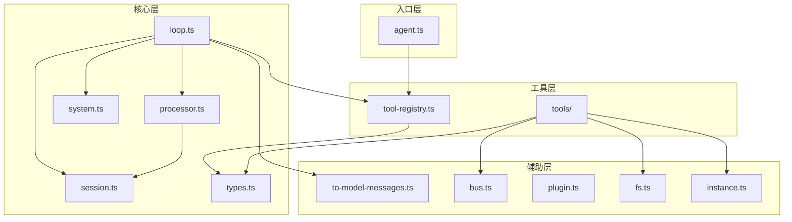

# src/agent 目录架构分析

## 1. 模块概览

```
src/agent/
├── agent.ts           # Agent 服务（管理 agent 注册）
├── loop.ts            # Agent 主循环（会话处理核心）
├── processor.ts       # 流处理器（处理 LLM 事件）
├── session.ts         # Session 存储（内存会话管理）
├── system.ts          # System Prompt 构建
├── types.ts           # 核心类型定义
├── tool-registry.ts   # 工具注册表
├── to-model-messages.ts  # 消息格式转换
├── instance.ts        # 项目实例信息
├── bus.ts             # 事件总线
├── plugin.ts          # 插件钩子
├── fs.ts              # 文件系统封装
├── shell.ts           # Shell 管理
├── lsp.ts             # LSP 集成
├── format.ts          # 格式化
├── permission.ts      # 权限管理
├── file-time.ts       # 文件时间追踪
├── truncate.ts        # 输出截断
├── flag.ts            # Feature Flag
├── bash-arity.ts      # Bash 参数解析
├── which.ts           # 命令查找
├── lazy.ts            # 延迟初始化
├── assert-external-directory.ts  # 外部目录检查
└── tools/             # 内置工具集
    ├── read.ts
    ├── edit.ts
    ├── write.ts
    ├── bash.ts
    ├── glob.ts
    ├── grep.ts
    └── descriptions/
```

## 2. 架构类图

```mermaid
classDiagram
    direction TB
    
    %% 核心接口
    class SessionStore {
        -sessions: Map~SessionID, Session~
        -messageIndex: Map~MessageID, {sessionID, index}~
        -partIndex: Map~PartID, {sessionID, messageID, index}~
        +create(cwd, root): Session
        +get(id): Session | undefined
        +addMessage(sessionID, info): Message
        +updatePart(sessionID, part): void
        +createAssistantMessage(...): AssistantMessage
        +getMessagesWithParts(sessionID): Message[]
    }
    
    class ToolRegistry {
        -tools: Map~string, ToolInfo~
        -initializedTools: Map~string, InitializedTool~
        +register(tool): void
        +getTools(agent?): Promise~InitializedTool[]~
    }
    
    class AgentService {
        -agents: Map~string, AgentInfo~
        -defaultAgentName: string
        +register(info): void
        +get(name): AgentInfo | undefined
        +list(): AgentInfo[]
        +defaultAgent(): AgentInfo
    }
    
    class SessionProcessor {
        -ctx: ProcessorContext
        -parts: Part[]
        +message: AssistantMessage
        +handleEvent(event): Effect~void~
        +getParts(): Part[]
        +process(input): Promise~ProcessorResult~
    }
    
    class BusClass {
        -handlers: Map~string, Set~EventHandler~~
        +publish(event, data): void
        +subscribe(event, handler): EventSubscription
    }
    
    %% 核心类型
    class UserMessage {
        +id: MessageID
        +sessionID: SessionID
        +role: "user"
        +model: {providerID, modelID}
        +system?: string
    }
    
    class AssistantMessage {
        +id: MessageID
        +sessionID: SessionID
        +role: "assistant"
        +finish?: string
        +tokens: {input, output, reasoning, cache}
        +error?: ErrorInfo
    }
    
    class Part {
        <<union>>
    }
    
    class TextPart {
        +id: PartID
        +type: "text"
        +text: string
        +time?: {start, end}
    }
    
    class ToolPart {
        +id: PartID
        +type: "tool"
        +tool: string
        +callID: string
        +state: ToolState
    }
    
    class ReasoningPart {
        +id: PartID
        +type: "reasoning"
        +text: string
        +time: {start, end?}
    }
    
    class StepStartPart {
        +id: PartID
        +type: "step-start"
    }
    
    class StepFinishPart {
        +id: PartID
        +type: "step-finish"
        +reason: string
        +tokens: {...}
    }
    
    %% 工具定义
    class ToolInfo {
        +id: string
        +init(ctx?): Promise~{description, parameters, execute}~
    }
    
    class ReadTool {
        +execute(args, ctx): Promise~{title, output, metadata, attachments?~
    }
    
    class EditTool {
        +execute(args, ctx): Promise~{title, output, metadata}~
    }
    
    class WriteTool {
        +execute(args, ctx): Promise~{title, output, metadata}~
    }
    
    class BashTool {
        +execute(params, ctx): Promise~{title, output, metadata}~
    }
    
    %% 关系
    SessionStore --> Message
    SessionStore --> Part
    Message --> UserMessage
    Message --> AssistantMessage
    Part <|-- TextPart
    Part <|-- ToolPart
    Part <|-- ReasoningPart
    Part <|-- StepStartPart
    Part <|-- StepFinishPart
    AgentService --> AgentInfo
    ToolRegistry --> ToolInfo
    ToolInfo <.. ReadTool
    ToolInfo <.. EditTool
    ToolInfo <.. WriteTool
    ToolInfo <.. BashTool
    SessionProcessor --> AssistantMessage
    SessionProcessor --> Part
    BusClass ..> BusEvent
```

## 3. 核心流程图

### 3.1 Agent Loop 主循环



### 3.2 Processor 流处理



### 3.3 工具执行流程



## 4. 执行流程伪代码

### 4.1 runAgentLoop 执行流程

```
函数 runAgentLoop(sessionID, abort, streamFactory?):
    
    1. 获取 Session
    ┌─────────────────────────────────────────┐
    │ session = sessionStore.get(sessionID)    │
    │ 如果不存在 → 抛出 "Session not found"    │
    └─────────────────────────────────────────┘
    
    2. 主循环 (while true)
    ┌─────────────────────────────────────────┐
    │ step++                                  │
    │                                         │
    │ 如果 abort.aborted:                     │
    │   抛出 "Agent loop aborted"             │
    │                                         │
    │ 重新获取消息历史:                        │
    │ messages = sessionStore.                 │
    │   getMessagesWithParts(sessionID)        │
    │                                         │
    │ 查找最后一条 UserMessage:                │
    │ lastUser = [...messages].reverse()      │
    │   .find(m → m.info.role === "user")     │
    └─────────────────────────────────────────┘
    
    3. 检查是否需要退出
    ┌─────────────────────────────────────────┐
    │ lastAssistant = 最后的 assistant msg    │
    │                                         │
    │ 如果 lastAssistant.finish 存在 且:      │
    │   不是 "tool-calls" 或 "unknown"        │
    │   且 lastUser.id < lastAssistant.id:    │
    │   返回 {message: lastAssistant, parts: []}│
    └─────────────────────────────────────────┘
    
    4. 获取模型并创建消息
    ┌─────────────────────────────────────────┐
    │ model = getModel(providerID, modelID)   │
    │                                         │
    │ assistantMessage = sessionStore.         │
    │   createAssistantMessage(                │
    │     sessionID, lastUser.id,              │
    │     modelID, providerID,                │
    │     "build", cwd, root                  │
    │   )                                     │
    │ sessionStore.addMessage(sessionID, msg)  │
    └─────────────────────────────────────────┘
    
    5. 创建 Processor
    ┌─────────────────────────────────────────┐
    │ processor = createProcessor({            │
    │   sessionID,                            │
    │   assistantMessage,                     │
    │   abort,                                │
    │   store: sessionStore,                  │
    │   streamFactory                         │
    │ })                                      │
    └─────────────────────────────────────────┘
    
    6. 构建 AI Tools
    ┌─────────────────────────────────────────┐
    │ tools = await toolRegistry.getTools({   │
    │   name: "build",                        │
    │   mode: "agent"                         │
    │ })                                      │
    │                                         │
    │ 构建 AI SDK 格式工具:                    │
    │ aiTools[tool.id] = tool({               │
    │   description: tool.description,         │
    │   inputSchema: tool.parameters,         │
    │   execute: (args, execOptions) → {     │
    │     ctx = {                             │
    │       sessionID,                        │
    │       messageID: processor.message.id,  │
    │       callID: execOptions.toolCallId,   │
    │       agent: "build",                   │
    │       abort: execOptions.abortSignal,  │
    │       messages,                         │
    │       metadata, ask                     │
    │     }                                  │
    │     return tool.execute(args, ctx)       │
    │   }                                    │
    │ })                                      │
    └─────────────────────────────────────────┘
    
    7. 构建 System Prompt
    ┌─────────────────────────────────────────┐
    │ systemPrompt = await buildSystemPrompt({ │
    │   model,                                │
    │   agentPrompt: ""                        │
    │ })                                      │
    │  // 组合: environment + provider       │
    └─────────────────────────────────────────┘
    
    8. 转换消息格式
    ┌─────────────────────────────────────────┐
    │ modelMessages = await toModelMessages(  │
    │   messages,                             │
    │   model                                 │
    │ )                                      │
    │ // 转换为 AI SDK 的 ModelMessage 格式   │
    └─────────────────────────────────────────┘
    
    9. 调用 processor.process
    ┌─────────────────────────────────────────┐
    │ streamInput = {                         │
    │   user: {id, sessionID, system, ...},   │
    │   sessionID,                            │
    │   model,                                │
    │   agent: {name: "build", mode: "agent"}, │
    │   system: systemPrompt,                 │
    │   abort,                                │
    │   messages: modelMessages,              │
    │   tools: aiTools                        │
    │ }                                      │
    │                                         │
    │ result = await processor.process(       │
    │   streamInput                           │
    │ )                                      │
    │ // 返回 "stop" | "continue" | "compact" │
    └─────────────────────────────────────────┘
    
    10. 处理结果
    ┌─────────────────────────────────────────┐
    │ 如果 result === "stop" 或 "compact":     │
    │   返回 {                                 │
    │     message: processor.message,         │
    │     parts: processor.getParts()          │
    │   }                                    │
    │                                         │
    │ 如果 result === "continue":             │
    │   继续下一轮循环                         │
    └─────────────────────────────────────────┘
```

### 4.2 Processor 处理流事件

```
函数 process(streamInput):
    
    1. 初始化
    ┌─────────────────────────────────────────┐
    │ needsCompaction = false                 │
    │ shouldBreak = false                      │
    │ currentText = undefined                 │
    │ reasoningMap = {}                        │
    │                                         │
    │ 获取流:                                 │
    │ rawEventStream = streamFactory()        │
    │   ? streamFactory()                     │
    │   : adaptStream(stream(streamInput))    │
    │ // adaptStream: AI SDK 事件 → StreamEvent│
    └─────────────────────────────────────────┘
    
    2. 遍历流事件
    ┌─────────────────────────────────────────┐
    │ for await (event of rawEventStream):     │
    │   abort.throwIfAborted()                │
    │   yield* handleEvent(event)             │
    │   // Effect 非阻塞处理                   │
    │                                         │
    │   如果 needsCompaction || shouldBreak:  │
    │     break                               │
    └─────────────────────────────────────────┘
    
    3. 清理和返回
    ┌─────────────────────────────────────────┐
    │ 执行 cleanup():                          │
    │   - 保存 currentText                    │
    │   - 保存 reasoningMap 中的 parts       │
    │   - 标记 running 的 tools 为 error      │
    │   - 设置 assistantMessage.time.completed│
    │                                         │
    │ 如果 abort.aborted:                     │
    │   执行 abortEffect()                    │
    │                                         │
    │ 如果 needsCompaction: return "compact"  │
    │ 如果 blocked 或 error 或 abort:         │
    │   return "stop"                        │
    │ 如果 finish === "stop": return "stop"   │
    │ 否则: return "continue"                 │
    └─────────────────────────────────────────┘
```

## 5. Part 生命周期



## 6. 关键数据结构

### 6.1 Session 和 Message 关系

```
Session
├── id: SessionID
├── createdAt: number
├── updatedAt: number
├── messages: Message[]
│   └── Message
│       ├── info: UserMessage | AssistantMessage
│       └── parts: Part[]
├── cwd: string
└── root: string
```

### 6.2 StreamEvent 类型

```
StreamEvent =
  | { type: "start" }
  | { type: "reasoning-start"; id: string; providerMetadata? }
  | { type: "reasoning-delta"; id: string; text: string; providerMetadata? }
  | { type: "reasoning-end"; id: string; providerMetadata? }
  | { type: "tool-input-start"; id: string; toolName: string; providerMetadata? }
  | { type: "tool-input-delta"; id: string; text: string }
  | { type: "tool-input-end"; id: string }
  | { type: "tool-call"; toolCallId: string; toolName: string; args: Record; providerMetadata? }
  | { type: "tool-result"; toolCallId: string; result: unknown; input?: Record }
  | { type: "tool-error"; toolCallId: string; error: Error; input?: Record }
  | { type: "error"; error: Error }
  | { type: "start-step" }
  | { type: "finish-step"; finishReason: "stop"|"tool-calls"|"unknown"; usage: {...} }
  | { type: "text-start"; providerMetadata? }
  | { type: "text-delta"; textDelta: string; providerMetadata? }
  | { type: "text-end"; providerMetadata? }
```

### 6.3 ToolContext

```
ToolContext
├── sessionID: SessionID
├── messageID: MessageID
├── agent: string
├── abort: AbortSignal
├── callID?: string
├── extra?: Record
├── messages: Message[]
├── metadata: (input) => void  // 更新工具元数据
└── ask: (input) => Promise<void>  // 请求权限
```

## 7. 模块依赖关系



## 8. 与 opencode 的设计对照

| 模块 | opencode 位置 | 本实现 |
|------|---------------|--------|
| Agent 管理 | `agent/agent.ts` | `agent.ts` |
| 会话循环 | `session/prompt.ts:278-762` | `loop.ts` |
| 流处理器 | `session/processor.ts` | `processor.ts` |
| 会话存储 | `session/*.ts` | `session.ts` |
| 消息类型 | `session/message-v2.ts` | `types.ts` |
| 工具注册 | `tool/registry.ts` | `tool-registry.ts` |
| 工具定义 | `tool/tool.ts` | `types.ts` (defineTool) |
| System Prompt | `session/system.ts` | `system.ts` |
| 消息转换 | `session/message-v2.ts:576-810` | `to-model-messages.ts` |
| Read Tool | `tool/read.ts` | `tools/read.ts` |
| Edit Tool | `tool/edit.ts` | `tools/edit.ts` |
| Write Tool | `tool/write.ts` | `tools/write.ts` |
| Bash Tool | `tool/bash.ts` | `tools/bash.ts` |
| 文件系统 | `util/filesystem.ts` | `fs.ts` |
| 事件总线 | `bus/index.ts` | `bus.ts` |
