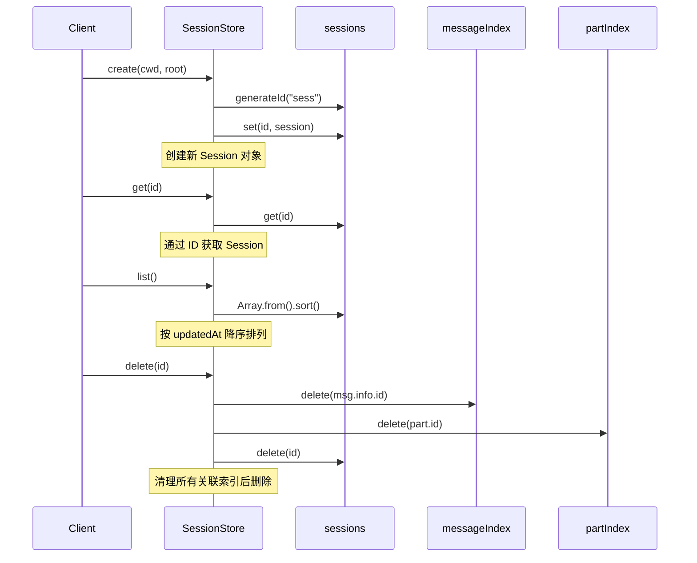
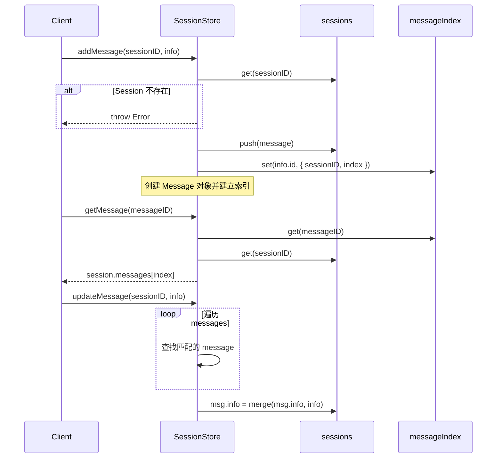
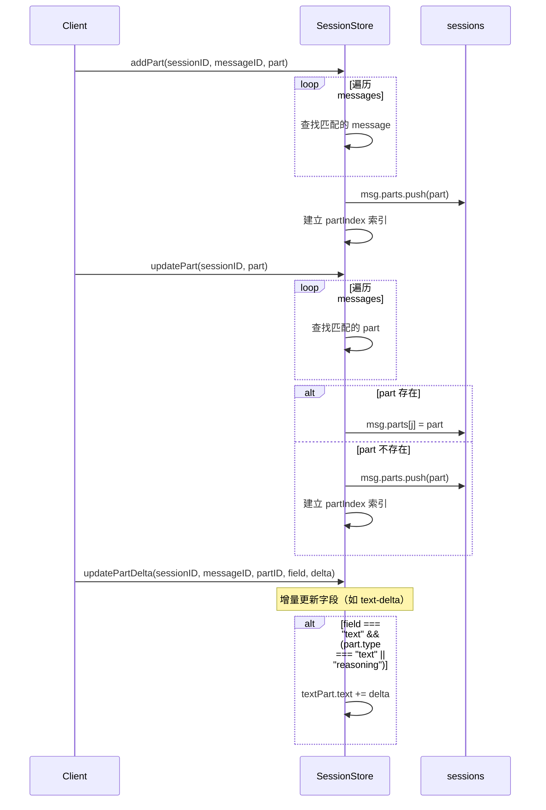

# Session 模块执行流程文档

## 概述

`src/agent/session.ts` 是会话管理模块，负责管理 AI 编程助手的会话状态。采用内存存储，完全参考 opencode 的设计。

---

## 核心数据结构

### SessionStore
- `sessions: Map<SessionID, Session>` - 会话存储
- `messageIndex: Map<MessageID, { sessionID, index }>` - 消息索引
- `partIndex: Map<PartID, { sessionID, messageID, index }>` - Part 索引

---

## 执行流程

### 1. 会话 (Session) 生命周期



### 2. 消息 (Message) 生命周期



### 3. Part 生命周期



---

## 核心流程伪代码

### 会话创建流程
```
函数 create(cwd, root):
    id ← generateId("sess")
    now ← Date.now()
    session ← {
        id,
        createdAt: now,
        updatedAt: now,
        messages: [],
        cwd,
        root
    }
    sessions.set(id, session)
    返回 session
```

### 消息添加流程
```
函数 addMessage(sessionID, info):
    session ← sessions.get(sessionID)
    如果 session 不存在:
        抛出错误 "Session not found"
    
    message ← { info, parts: [] }
    index ← session.messages.length
    session.messages.push(message)
    messageIndex.set(info.id, { sessionID, index })
    session.updatedAt ← Date.now()
    
    返回 message
```

### Part 增量更新流程
```
函数 updatePartDelta(sessionID, messageID, partID, field, delta):
    session ← sessions.get(sessionID)
    如果 session 不存在: 返回
    
    对于 session.messages 中的每个 msg:
        如果 msg.info.id === messageID:
            对于 msg.parts 中的每个 part:
                如果 part.id === partID:
                    如果 field === "text" 且 part.type 是 "text" 或 "reasoning":
                        part.text ← part.text + delta
                    返回
```

### 消息创建辅助函数

**createAssistantMessage** - 创建助手消息
```
函数 createAssistantMessage(sessionID, parentID, modelID, providerID, agent, cwd, root):
    id ← generateId("msg")
    now ← Date.now()
    返回 AssistantMessage {
        id,
        sessionID,
        role: "assistant",
        time: { created: now },
        parentID,
        modelID,
        providerID,
        mode: "agent",
        agent,
        path: { cwd, root },
        cost: 0,
        tokens: { input: 0, output: 0, reasoning: 0, cache: { read: 0, write: 0 } }
    }
```

**createUserMessage** - 创建用户消息
```
函数 createUserMessage(sessionID, agent, providerID, modelID):
    id ← generateId("msg")
    now ← Date.now()
    返回 UserMessage {
        id,
        sessionID,
        role: "user",
        time: { created: now },
        agent,
        model: { providerID, modelID }
    }
```

---

## 全局导出

| 导出 | 说明 |
|------|------|
| `SessionStore` | 会话存储类 |
| `sessionStore` | 全局单例实例 |
| `generatePartID()` | 生成 PartID：`part_${Date.now()}_${counter}` |
| `generateMessageID()` | 生成 MessageID：`msg_${Date.now()}_${counter}` |

---

## 设计特点

1. **内存存储** - 使用 Map 实现高性能读写
2. **三层索引** - session/message/part 三级索引加速查找
3. **增量更新** - 支持 text-delta 增量追加，无需全量替换
4. **时间排序** - list() 返回按 updatedAt 降序排列的会话列表
