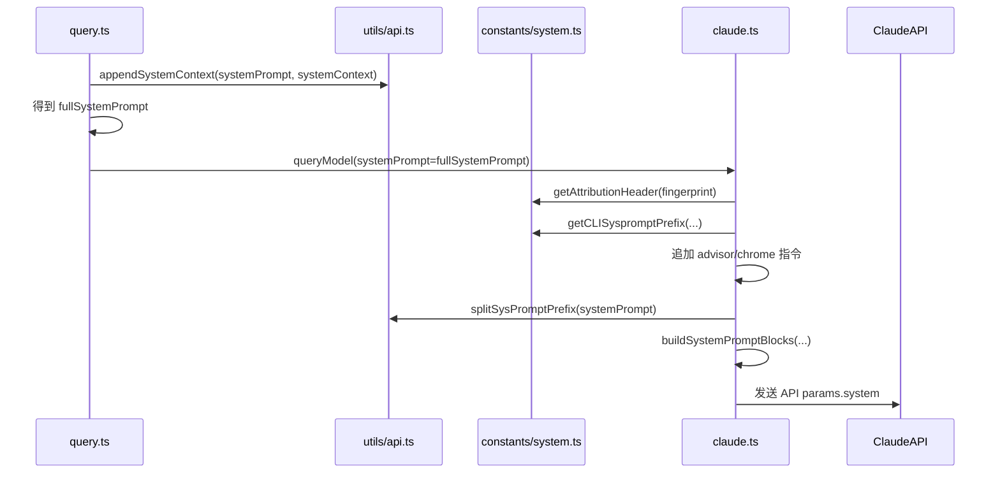

# System Prompt 组装主线

## 概述
这篇文档只回答一个问题：

> `system prompt` 到底是怎么从 `query.ts` 一路变成 API 最终收到的 `system` blocks 的？

如果你真正关心的是 system prompt，那只需要盯这一条线：

```text
原始 systemPrompt
    ↓
appendSystemContext(systemPrompt, systemContext)
    ↓
fullSystemPrompt
    ↓
claude.ts 再追加：
  attribution header
  CLI sysprompt prefix
  advisor / chrome 等附加指令
    ↓
splitSysPromptPrefix(...)
    ↓
buildSystemPromptBlocks(...)
    ↓
API params.system
```

这篇不再展开 `messages` 和 `tools`，只讲 `system`。

## 先看结论

### 1. `query.ts` 只做第一轮 system prompt 拼装
在 `query.ts` 里，system prompt 只做了一件事：

- 把 `systemContext` 追加进去

得到：

- `fullSystemPrompt`

它还不是最终发给 API 的 `system`。

### 2. 真正的 system prompt 成形在 `claude.ts`
进入 `src/services/api/claude.ts` 之后，还会继续加：

- attribution header
- CLI sysprompt prefix
- advisor instructions
- chrome tool search instructions

然后再变成 API 需要的 `TextBlockParam[]`。

### 3. 最后发给 API 的不是字符串，而是 system blocks
最终 API 收到的是：

- `system: TextBlockParam[]`

不是：

- 一个简单拼好的大字符串

## 执行流程（伪代码）
```text
queryLoop 开始一轮 turn
    ↓
systemPrompt + systemContext
    ↓
fullSystemPrompt
    ↓
进入 claude.ts queryModel
    ↓
再追加 CLI / attribution / advisor / chrome 指令
    ↓
把 system prompt 按缓存策略拆块
    ↓
得到 API 的 system blocks
```

## 涉及的核心文件
```text
src/query.ts
  - 生成 fullSystemPrompt

src/utils/api.ts
  - appendSystemContext()
  - splitSysPromptPrefix()
  - logAPIPrefix()

src/constants/system.ts
  - getCLISyspromptPrefix()
  - getAttributionHeader()

src/services/api/claude.ts
  - queryModel()
  - buildSystemPromptBlocks()

src/utils/systemPromptType.ts
  - SystemPrompt 类型
```

## 第一层：`query.ts` 里只做了一次追加

真正相关的代码很短：

```449:451:src/query.ts
const fullSystemPrompt = asSystemPrompt(
  appendSystemContext(systemPrompt, systemContext),
)
```

这句的含义非常直接：

- 原始输入是 `systemPrompt`
- 再把 `systemContext` 追加进去
- 最后重新包装成 `SystemPrompt`

### `SystemPrompt` 本质上是什么
它不是复杂对象，就是一个带品牌的字符串数组：

```8:13:src/utils/systemPromptType.ts
export type SystemPrompt = readonly string[] & {
  readonly __brand: 'SystemPrompt'
}

export function asSystemPrompt(value: readonly string[]): SystemPrompt {
  return value as SystemPrompt
}
```

所以你可以先把它粗略理解成：

- `SystemPrompt = string[]`

只是类型上做了品牌标记，避免乱传。

### `appendSystemContext()` 做了什么
实现也很直接：

```437:446:src/utils/api.ts
export function appendSystemContext(
  systemPrompt: SystemPrompt,
  context: { [k: string]: string },
): string[] {
  return [
    ...systemPrompt,
    Object.entries(context)
      .map(([key, value]) => `${key}: ${value}`)
      .join('\n'),
  ].filter(Boolean)
}
```

也就是说：

- 原本的 `systemPrompt` 每一项都保留
- `systemContext` 会被拍平成一段文本
- 然后追加到末尾

所以在 `query.ts` 这一层：

- `systemPrompt`
  - 还是“基础 prompt”
- `fullSystemPrompt`
  - 是“基础 prompt + systemContext”

## 第二层：到了 `claude.ts`，system prompt 还会再长一层

进入 `queryModel()` 后，真正关键的是这里：

```1357:1369:src/services/api/claude.ts
systemPrompt = asSystemPrompt(
  [
    getAttributionHeader(fingerprint),
    getCLISyspromptPrefix({
      isNonInteractive: options.isNonInteractiveSession,
      hasAppendSystemPrompt: options.hasAppendSystemPrompt,
    }),
    ...systemPrompt,
    ...(advisorModel ? [ADVISOR_TOOL_INSTRUCTIONS] : []),
    ...(injectChromeHere ? [CHROME_TOOL_SEARCH_INSTRUCTIONS] : []),
  ].filter(Boolean),
)
```

这里才是真正的第二轮拼装。

这句说明：

- `query.ts` 传进来的 `fullSystemPrompt`
  - 只是中间产物
- `claude.ts` 又在它前后插了新的 system 片段

最终 system prompt 可能包含：

1. attribution header
2. CLI sysprompt prefix
3. `query.ts` 传进来的 `fullSystemPrompt`
4. advisor instructions
5. chrome tool search instructions

## 第三层：这些附加 system 片段分别是什么

### 1. CLI sysprompt prefix
它来自：

```30:46:src/constants/system.ts
export function getCLISyspromptPrefix(options?: {
  isNonInteractive: boolean
  hasAppendSystemPrompt: boolean
}): CLISyspromptPrefix {
  const apiProvider = getAPIProvider()
  if (apiProvider === 'vertex') {
    return DEFAULT_PREFIX
  }

  if (options?.isNonInteractive) {
    if (options.hasAppendSystemPrompt) {
      return AGENT_SDK_CLAUDE_CODE_PRESET_PREFIX
    }
    return AGENT_SDK_PREFIX
  }
  return DEFAULT_PREFIX
}
```

所以 CLI prefix 不是固定一条，而是会根据：

- provider
- 是否非交互
- 是否 append system prompt

来变。

### 2. attribution header
它来自：

```73:94:src/constants/system.ts
export function getAttributionHeader(fingerprint: string): string {
  if (!isAttributionHeaderEnabled()) {
    return ''
  }

  const version = `${MACRO.VERSION}.${fingerprint}`
  const entrypoint = process.env.CLAUDE_CODE_ENTRYPOINT ?? 'unknown'
  const header = `x-anthropic-billing-header: cc_version=${version}; cc_entrypoint=${entrypoint};...`
  return header
}
```

它的作用不是“提示模型怎么回答”，而更像：

- 请求归因
- 版本 / 入口标识
- 某些 workload / attestation 信息

但它仍然是作为 system prompt 的一部分被放进去。

### 3. advisor / chrome 指令
这两类是条件追加：

- 开启 advisor 时，追加 `ADVISOR_TOOL_INSTRUCTIONS`
- tool search + chrome tools 命中时，追加 `CHROME_TOOL_SEARCH_INSTRUCTIONS`

所以它们不是每轮都会出现。

## 第四层：system prompt 不会直接原样发给 API，而是先拆块

拼完之后，还不会直接拿这个 `string[]` 去发。

下一步是：

```1374:1379:src/services/api/claude.ts
const enablePromptCaching =
  options.enablePromptCaching ?? getPromptCachingEnabled(options.model)
const system = buildSystemPromptBlocks(systemPrompt, enablePromptCaching, {
  skipGlobalCacheForSystemPrompt: needsToolBasedCacheMarker,
  querySource: options.querySource,
})
```

也就是说，真正发出去的不是：

- `systemPrompt: string[]`

而是：

- `system: TextBlockParam[]`

## 第五层：`splitSysPromptPrefix()` 为什么重要

`buildSystemPromptBlocks()` 的实现核心是：

```3213:3236:src/services/api/claude.ts
export function buildSystemPromptBlocks(
  systemPrompt: SystemPrompt,
  enablePromptCaching: boolean,
  options?: {
    skipGlobalCacheForSystemPrompt?: boolean
    querySource?: QuerySource
  },
): TextBlockParam[] {
  return splitSysPromptPrefix(systemPrompt, {
    skipGlobalCacheForSystemPrompt: options?.skipGlobalCacheForSystemPrompt,
  }).map(block => {
    return {
      type: 'text' as const,
      text: block.text,
      ...(enablePromptCaching &&
        block.cacheScope !== null && {
          cache_control: getCacheControl({
            scope: block.cacheScope,
            querySource: options?.querySource,
          }),
        }),
    }
  })
}
```

所以这里真正重要的是：

- 先 `splitSysPromptPrefix(...)`
- 再把拆好的块映射成 API text block

也就是说，system prompt 在发送前会被“结构化拆块”。

## 第六层：`splitSysPromptPrefix()` 到底怎么拆

这是 system prompt 组装里最容易被忽略、但最关键的函数。

它的职责不是拼内容，而是：

> 把 system prompt 按“归因头 / CLI 前缀 / 静态内容 / 动态内容”拆成不同 block，并给每块决定缓存范围。

源码注释已经把三种模式说得很清楚：

### 模式 A：有 MCP 工具，不能把 system prompt 放进 global cache
结果通常会拆成：

1. attribution header
2. CLI sysprompt prefix
3. 其余全部内容

其中 prefix 和 rest 通常是 `org` 级缓存。

### 模式 B：开启 global cache，且找到了 boundary marker
结果可能拆成：

1. attribution header
2. CLI sysprompt prefix
3. boundary 前的静态内容
4. boundary 后的动态内容

这里最关键的是：

- 静态块可以走 `global` cache
- 动态块不进全局缓存

### 模式 C：默认模式
结果通常拆成：

1. attribution header
2. CLI sysprompt prefix
3. 其余全部内容

一般走 `org` 级缓存。

所以它不是简单地：

- “把数组 join 一下”

而是在做：

- 结构拆分
- 缓存边界规划

## 一个最简心智模型

如果把 system prompt 这条线尽量压缩，可以记成：

```text
query.ts:
  基础 systemPrompt
  + systemContext
    ↓
claude.ts:
  + attribution
  + CLI prefix
  + advisor/chrome 指令
    ↓
splitSysPromptPrefix:
  按缓存策略拆块
    ↓
buildSystemPromptBlocks:
  变成 API system blocks
```

## 时序图


## 为什么你打断点可能没感觉

### 1. 你可能只打在 `query.ts`
如果你只打在：

- `const fullSystemPrompt = ...`

你只能看到：

- `systemContext` 被追加完

但你还看不到：

- attribution header
- CLI sysprompt prefix
- advisor/chrome 指令
- system blocks 拆分

因为这些都在 `claude.ts` 后面。

### 2. 你可能打在没触发的条件分支
这些 system 片段不是每轮都出现：

- advisor 指令依赖 advisor 开关
- chrome 指令依赖 tool search + chrome tools
- global cache 分块依赖 boundary marker 和缓存策略

所以打在某些分支里，不触发是正常的。

## 建议断点顺序
如果你只想看 system prompt，建议按这个顺序打：

1. `src/query.ts`
   - `const fullSystemPrompt = ...`
2. `src/services/api/claude.ts`
   - `systemPrompt = asSystemPrompt([...])`
3. `src/utils/api.ts`
   - `splitSysPromptPrefix(systemPrompt, ...)`
4. `src/services/api/claude.ts`
   - `const system = buildSystemPromptBlocks(...)`
5. `src/services/api/claude.ts`
   - `return { ..., system, ... }` in `paramsFromContext()`

## 本文最重要的结论
如果你现在只关心 system prompt，那就记这一句：

> `query.ts` 只负责把 `systemContext` 拼进基础 `systemPrompt`，真正发给 API 的 system prompt 是在 `claude.ts` 里继续追加系统级指令，再经过 `splitSysPromptPrefix()` 和 `buildSystemPromptBlocks()` 拆成 blocks 之后才最终成形。
