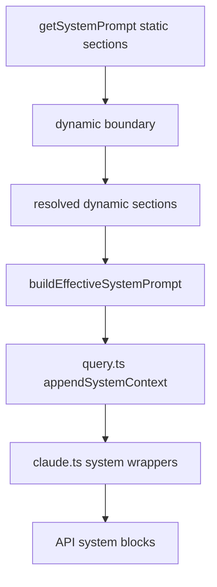

# System Prompt 架构总览

## 概述
这篇文档只讲 `Claude Code` 的常态路径。

不讨论“理论上支持哪些 CLI 覆盖参数”，先看真实默认行为：

- TUI 每轮先调用 `getSystemPrompt()`
- 得到一个 `string[]`
- 这个数组不是“随便拼的几段文案”，而是 Claude Code 的默认 system prompt 骨架

你如果想理解 Claude Code 的重点，第一眼就该看这层，而不是先看 `--system-prompt`。

## 先看真实结果

我直接在当前仓库运行了 `getSystemPrompt()`，当前环境下拿到的是 13 段：

1. interactive agent intro
2. `# System`
3. `# Doing tasks`
4. `# Executing actions with care`
5. `# Using your tools`
6. `# Tone and style`
7. `# Output efficiency`
8. `__SYSTEM_PROMPT_DYNAMIC_BOUNDARY__`
9. `# Session-specific guidance`
10. `# auto memory`
11. `# Environment`
12. `# Language`
13. function-result-clearing instructions

也就是说，默认 system prompt 的真实结构就是：

```text
静态骨架
    ↓
dynamic boundary
    ↓
本轮命中的动态 sections
```

这才是 Claude Code 的 prompt 架构重点。

## 执行流程（默认路径）
```text
REPL 开始一轮 turn
    ↓
getSystemPrompt(...)
    ↓
得到默认 prompt sections[]
    ↓
buildEffectiveSystemPrompt(...)
    ↓
通常情况下直接返回默认 prompt
    ↓
query.ts 把 systemContext 追加进去
    ↓
claude.ts 再包装成最终 API system blocks
```

## 第一层：默认 prompt 不是一个字符串，而是一个 section 数组

`getSystemPrompt()` 的返回类型就是：

- `Promise<string[]>`

所以默认 prompt 从设计上就不是：

- 一大段完整 system prompt 字符串

而是：

- 一组有顺序的 prompt sections

这意味着 Claude Code 的设计重点是：

> 先把 prompt 组织成稳定的 section 骨架，再按环境拼接命中的动态段。

## 第二层：最重要的是“静态骨架 + 动态尾部”

源码里最关键的返回结构就是这段：

```text
return [
  静态 sections,
  SYSTEM_PROMPT_DYNAMIC_BOUNDARY,
  resolvedDynamicSections,
].filter(...)
```

这说明默认 prompt 有两个核心区：

### 1. 静态骨架
这部分是稳定的、缓存友好的、定义 Claude Code 基本人设和工作方式的部分。

当前主线包括：

- intro
- `# System`
- `# Doing tasks`
- `# Executing actions with care`
- `# Using your tools`
- `# Tone and style`
- `# Output efficiency`

这些不是“附加说明”，而是 Claude Code 的主行为约束。

### 2. 动态尾部
静态骨架后面有一个明确的边界标记：

- `__SYSTEM_PROMPT_DYNAMIC_BOUNDARY__`

这个标记的意义不是给人看的，而是给系统自己分层用的：

- 前面是尽量稳定、利于 cache 的前缀
- 后面是按当前 session / feature / env 命中的动态段

所以默认 prompt 的重点不是“哪一条指令写了什么”，而是：

> Claude Code 先把 prompt 切成一个稳定前缀，再把变化大的东西放到边界后面。

## 第三层：动态 sections 是一个 registry，不是 if/else 大拼盘

动态区不是临时字符串拼接，而是显式注册的 sections：

- `session_guidance`
- `memory`
- `ant_model_override`
- `env_info_simple`
- `language`
- `output_style`
- `mcp_instructions`
- `scratchpad`
- `frc`
- `summarize_tool_results`
- `numeric_length_anchors`（ant-only）
- `token_budget`
- `brief`

然后统一走：

- `resolveSystemPromptSections(dynamicSections)`

这说明设计上它更像：

> 默认 prompt section registry

而不是：

> 某个大函数里到处乱塞 prompt 文本

## 第四层：为什么你看到的是 13 段，不是 registry 全命中

因为 `dynamicSections` 里很多项会返回 `null`。

当前环境下实际命中的动态段，只有这些：

- `session_guidance`
- `memory`
- `env_info_simple`
- `language`
- `frc`

没命中的一般是：

- `output_style`
- `mcp_instructions`
- `scratchpad`
- `summarize_tool_results` 之外的某些 feature 段
- `token_budget`
- `brief`

所以真实运行结果不是“registry 里有多少项，就一定输出多少项”，而是：

> registry 定义候选段，当前环境决定哪些段真的出现。

## 第五层：默认路径里，真正的核心是 `getSystemPrompt()`，不是 `buildEffectiveSystemPrompt()`

这里要纠正一个很容易讲偏的地方。

如果站在“Claude Code 的默认常态路径”上看：

- 真正最重要的是 `getSystemPrompt()`

因为正常情况下：

- 没有自定义 `systemPrompt`
- 没有特殊 override
- 没有 coordinator prompt 替换
- 没有 agent prompt 替换

这时 `buildEffectiveSystemPrompt()` 实际上只是把默认 prompt 原样放过去。

所以从理解优先级来说：

### 默认路径
先看：

- `getSystemPrompt()`

再看：

- `buildEffectiveSystemPrompt()`

而不是反过来。

## 第六层：`buildEffectiveSystemPrompt()` 处理的是“例外路径”

这个函数重要，但它的重要性在于：

- 它定义了默认 prompt 何时会被替换或叠加

它处理的主要是这些例外：

- coordinator mode
- main-thread agent
- custom system prompt
- proactive / Kairos 下 agent append
- `appendSystemPrompt`

所以它更准确的定位是：

> 默认 prompt 的外层包裹器 / 例外分派器

而不是 Claude Code 默认 prompt 架构本体。

## 第七层：`plan mode` 不是另一套主 system prompt

这是你前面一直在追的重点，这里单独说清楚。

从当前源码结构看，`plan mode` 主要影响的是：

- `toolPermissionContext.mode === 'plan'`
- auto / classifier 语义
- plan-mode attachment 和 instructions
- 某些模型选择逻辑

但它不是：

- 切换到另一套 `getSystemPrompt()` 模板

也就是说，目前并不存在一个非常显式的：

- `getPlanModeSystemPrompt()`

这类主入口。

所以更准确地讲：

> `plan mode` 是运行模式 / 权限模式 / 附件注入层的变化，不是默认主 system prompt 模板的平行分支。

## 第八层：真正的四层结构

现在可以把 Claude Code 的 system prompt 架构压成四层：

### 第 1 层：默认 prompt 骨架层
谁定义 Claude Code 默认的人设、工具观、语气、工作方式？

- `getSystemPrompt()` 的静态 sections

### 第 2 层：动态 section 命中层
谁把 memory、environment、language、MCP 等当前环境信息塞进去？

- `dynamicSections`
- `resolveSystemPromptSections(...)`

### 第 3 层：例外覆盖层
什么时候默认 prompt 会被 agent / coordinator / custom prompt 替换或叠加？

- `buildEffectiveSystemPrompt()`

### 第 4 层：请求包装层
什么时候再追加 `systemContext`、CLI prefix、advisor 等 API 层系统指令？

- `query.ts`
- `claude.ts`

## 架构图


## 你现在最该记住的结论

### 1. Claude Code 的重点首先是默认 prompt 骨架
先看 `getSystemPrompt()`，而不是先看各种覆盖参数。

### 2. 默认 prompt 的结构是“稳定骨架 + 动态尾部”
`__SYSTEM_PROMPT_DYNAMIC_BOUNDARY__` 就是这个设计的明确信号。

### 3. `buildEffectiveSystemPrompt()` 主要处理例外，不是默认主线本体
它重要，但默认路径里不是第一关注点。

### 4. `plan mode` 不是另一套主 system prompt 模板
它更像运行模式和权限模式变化。

## 一句话总结

> Claude Code 的 System Prompt 架构，默认主线不是“从入口拿参数然后拼字符串”，而是 `getSystemPrompt()` 先产出一个“静态骨架 + dynamic boundary + 命中动态段”的 section 数组，再由外层例外逻辑和请求包装层继续加工。
