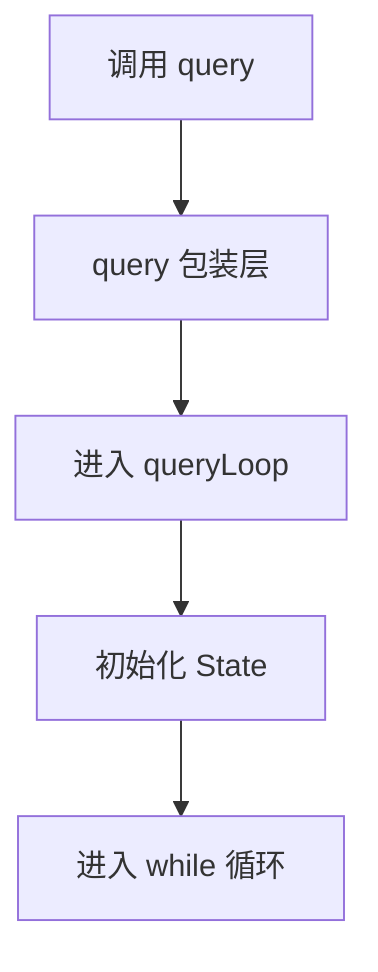

# 1. QueryLoop 入口与状态

## 这套文档现在怎么读
这组文档现在按一条主线走，只保留 4 个主章节：

1. 入口与状态
2. 请求前上下文整理
3. 流式阶段与消息组装
4. 流后分叉与下一轮闭环

另外还有两份补充材料：

- `queryloop-deep-dive.md`
  - 一页速查，不按源码细讲
- `checkpoints/README.md`
  - 术语附录，不属于 queryLoop 主线

## 这一章解决什么问题
这一章只解决 3 个最基础的问题：

1. `query()` 和 `queryLoop()` 的关系是什么
2. `QueryParams` 到底是什么
3. `State` 为什么是理解整个主循环的核心

如果这 3 个点不稳，后面读任何局部代码都会乱。

## 执行流程（伪代码）
```text
外部调用 query(params)
    ↓
query() 只是包装器
    ↓
真正进入 queryLoop(params, consumedCommandUuids)
    ↓
queryLoop 把 params 转成初始 state
    ↓
后面的 while (true) 都是在不断更新 state
```

## 在整体流程中的位置


## `query()` 和 `queryLoop()` 的关系
`query()` 不是主逻辑本体，它更像一个薄包装器。

```219:239:src/query.ts
export async function* query(
  params: QueryParams,
): AsyncGenerator<
  | StreamEvent
  | RequestStartEvent
  | Message
  | TombstoneMessage
  | ToolUseSummaryMessage,
  Terminal
> {
  const consumedCommandUuids: string[] = []
  const terminal = yield* queryLoop(params, consumedCommandUuids)
  for (const uuid of consumedCommandUuids) {
    notifyCommandLifecycle(uuid, 'completed')
  }
  return terminal
}
```

这段代码的重点只有两个：

- `yield* queryLoop(...)`
  - 说明真正的事件流来自 `queryLoop()`
- `consumedCommandUuids`
  - 说明 `query()` 还负责一些外围生命周期清理

所以你调试时，一旦进了 `queryLoop()`，就已经到了最核心的地方。

## `QueryParams`：单次调用的固定输入
`QueryParams` 可以理解成：

> 这一轮 query 启动时，外部一次性提供给主循环的输入。

```181:199:src/query.ts
export type QueryParams = {
  messages: Message[]
  systemPrompt: SystemPrompt
  userContext: { [k: string]: string }
  systemContext: { [k: string]: string }
  canUseTool: CanUseToolFn
  toolUseContext: ToolUseContext
  fallbackModel?: string
  querySource: QuerySource
  maxOutputTokensOverride?: number
  maxTurns?: number
  skipCacheWrite?: boolean
  taskBudget?: { total: number }
  deps?: QueryDeps
}
```

这里最重要的字段是：

- `messages`
  - 当前已有消息历史
- `systemPrompt`
  - 系统提示词
- `userContext` / `systemContext`
  - 额外上下文
- `canUseTool`
  - 工具权限决策入口
- `toolUseContext`
  - 整个工具运行环境
- `querySource`
  - 当前这次 query 从哪里发起

理解时可以先忽略：

- `maxOutputTokensOverride`
- `maxTurns`
- `skipCacheWrite`
- `taskBudget`
- `deps`

这些是后面恢复、限额和测试替换会用到的扩展字段。

## `State`：跨轮次持续变化的运行时状态
如果说 `QueryParams` 是“启动输入”，那 `State` 就是：

> `queryLoop` 每跑完一轮后，继续带到下一轮的真实状态。

```203:217:src/query.ts
type State = {
  messages: Message[]
  toolUseContext: ToolUseContext
  autoCompactTracking: AutoCompactTrackingState | undefined
  maxOutputTokensRecoveryCount: number
  hasAttemptedReactiveCompact: boolean
  maxOutputTokensOverride: number | undefined
  pendingToolUseSummary: Promise<ToolUseSummaryMessage | null> | undefined
  stopHookActive: boolean | undefined
  turnCount: number
  transition: Continue | undefined
}
```

最重要的不是每个字段本身，而是这个观念：

> `queryLoop` 并不是在修改 `QueryParams`，而是在不断写回新的 `State`。

## `queryLoop()` 入口如何把 `QueryParams` 变成 `State`
这一步是整个主循环真正的起点。

```242:280:src/query.ts
async function* queryLoop(
  params: QueryParams,
  consumedCommandUuids: string[],
): AsyncGenerator<
  | StreamEvent
  | RequestStartEvent
  | Message
  | TombstoneMessage
  | ToolUseSummaryMessage,
  Terminal
> {
  const {
    systemPrompt,
    userContext,
    systemContext,
    canUseTool,
    fallbackModel,
    querySource,
    maxTurns,
    skipCacheWrite,
  } = params
  const deps = params.deps ?? productionDeps()

  let state: State = {
    messages: params.messages,
    toolUseContext: params.toolUseContext,
    maxOutputTokensOverride: params.maxOutputTokensOverride,
    autoCompactTracking: undefined,
    stopHookActive: undefined,
    maxOutputTokensRecoveryCount: 0,
    hasAttemptedReactiveCompact: false,
    turnCount: 1,
    pendingToolUseSummary: undefined,
    transition: undefined,
  }
```

这里可以分两层理解：

### 第一层：从 `params` 里拆出不变的东西
例如：

- `systemPrompt`
- `userContext`
- `systemContext`
- `canUseTool`
- `querySource`

这些在整个 `queryLoop` 生命周期里通常不重新赋值。

### 第二层：创建后面要不断变化的 `state`
例如：

- `messages`
- `toolUseContext`
- `turnCount`
- `transition`

后面的 `continue` / `state = next` / 下一轮推进，几乎都围绕这些字段。

## 为什么 `State` 是核心
因为理解 `queryLoop()`，本质上就是理解：

> 每一轮循环结束后，哪些字段被写进了新的 `state`。

这意味着你看代码时，最该问的不是：

- “这行代码干了什么功能”

而是：

- “这行代码有没有改 `state`”
- “它改的是哪一部分状态”
- “这些状态会怎么影响下一轮”

## 当前阶段最重要的 4 个字段
如果你想先抓重点，只盯这 4 个就够了：

### 1. `messages`
这是整个主循环最重要的字段。

它代表：

- 当前已经累积的对话历史
- 下一轮构造 `messagesForQuery` 的基础

### 2. `toolUseContext`
它不是“工具列表”那么简单，而是整个工具运行环境：

- permissions
- app state
- current messages
- abort controller
- readFileState

### 3. `turnCount`
它告诉你当前已经推进到第几轮。

### 4. `transition`
它记录上一轮为什么继续。

这对调试很重要，因为你可以通过它快速判断：

- 是正常进入下一轮
- 还是因为恢复逻辑重试
- 还是因为 token budget continuation

## 这一章的一个最小心智模型
可以先只记住这句：

> `QueryParams` 是入口输入，`State` 是循环中的真实运行状态，`queryLoop` 的本质就是不断把旧 `state` 变成新 `state`。

## 一个具体例子
假设外部第一次调用：

```ts
query({
  messages: [userMessage],
  systemPrompt,
  userContext,
  systemContext,
  canUseTool,
  toolUseContext,
  querySource,
})
```

那么刚进入 `queryLoop()` 时，你可以近似理解成：

```ts
state = {
  messages: [userMessage],
  toolUseContext,
  turnCount: 1,
  transition: undefined,
  ...
}
```

这说明第一轮循环真正吃进去的基础状态就是：

- 一组初始 `messages`
- 一份 `toolUseContext`
- 一些恢复计数器归零

## 本章总结
这一章先不要碰任何分支细节，只需要先稳住两件事：

1. `query()` 只是包装器，真正主逻辑是 `queryLoop()`
2. `queryLoop()` 的本质，是不断更新 `state`

下一章进入 turn 的第一步：

- `messagesForQuery` 是怎么从 `state.messages` 整理出来的
- 为什么模型调用前会先做五层上下文整理
