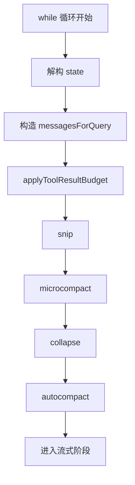

# 2. QueryLoop 请求前上下文整理

## 这一章解决什么问题
这一章只回答一个问题：

> 在真正调用模型之前，`queryLoop()` 到底对当前历史做了哪些整理，为什么要整理？

如果这一段不稳，后面你会经常分不清：

- `state.messages`
- `messagesForQuery`

也会不明白为什么“还没开始流式接收”，前面就已经有这么多处理步骤。

## 本章先给一个总心智模型
这一章最重要的区分只有两个：

- `state.messages`
  - 跨 turn 保留的历史状态
- `messagesForQuery`
  - 本轮整理后真正要发给模型的请求视图

所以这里不是“拿着旧历史直接去问模型”，而是：

```text
旧 state.messages
    ↓
裁短、删除、清空旧内容、折叠、压缩
    ↓
得到本轮 messagesForQuery
    ↓
再把它交给 deps.callModel(...)
```

## 执行流程（伪代码）
```text
进入 while (true)
    ↓
从 state 解构本轮变量
    ↓
从 state.messages 构造 messagesForQuery
    ↓
applyToolResultBudget
    ↓
snip
    ↓
microcompact
    ↓
collapse
    ↓
autocompact
    ↓
得到本轮真正发给模型的 messagesForQuery
```

## 在整体流程中的位置


## 循环开头先做什么
每一轮最开始，`queryLoop()` 都会先把 `state` 解构成本轮局部变量。

```307:323:src/query.ts
while (true) {
  let { toolUseContext } = state
  const {
    messages,
    autoCompactTracking,
    maxOutputTokensRecoveryCount,
    hasAttemptedReactiveCompact,
    maxOutputTokensOverride,
    pendingToolUseSummary,
    stopHookActive,
    turnCount,
  } = state
```

这一步的作用是：

- 让后面逻辑直接围绕本轮局部变量展开
- 同时明确区分：
  - 旧状态里读出来的值
  - 后面可能写回新 `state` 的值

## `messagesForQuery` 从哪里来
真正的起点是这一句：

```366:366:src/query.ts
let messagesForQuery = [...getMessagesAfterCompactBoundary(messages)]
```

这说明：

- 本轮真正发给模型的消息，不直接等于 `state.messages`
- 而是先从 `state.messages` 中取一个“当前请求视图”

`getMessagesAfterCompactBoundary(messages)` 的意义可以先粗略理解为：

> compact boundary 之前已经被历史压缩掉的那一截，不应该重新参与本轮 API 请求。

## 为什么会有这么多整理手段
因为 queryLoop 每轮都在面对同一个压力：

> 对话历史会不断增长，但模型的上下文窗口是有限的。

这几层整理不是同一种压缩技术拆开写，而是一个从轻到重的分级响应系统：

| 手段 | 主要解决的问题 | 对 `messagesForQuery` 做什么 |
|------|----------------|------------------------------|
| `applyToolResultBudget` | 单条 tool result 太大 | 把超长结果替换成预览 |
| `snip` | 历史消息太多 | 直接裁掉更早的消息 |
| `microcompact` | 旧 tool result 积累 | 清掉旧结果内容但保留结构 |
| `collapse` | 需要可回滚的折叠 | 把一段历史投影成结构化摘要 |
| `autocompact` | 快触顶了 | 调 summarizer 生成新摘要边界 |

## 第一层：`applyToolResultBudget`
```377:395:src/query.ts
messagesForQuery = await applyToolResultBudget(
  messagesForQuery,
  toolUseContext.contentReplacementState,
  persistReplacements
    ? records =>
        void recordContentReplacement(
          records,
          toolUseContext.agentId,
        ).catch(logError)
    : undefined,
  new Set(
    toolUseContext.options.tools
      .filter(t => !Number.isFinite(t.maxResultSizeChars))
      .map(t => t.name),
  ),
)
```

这一步的重点不是具体替换算法，而是：

> 在请求发出去前，先控制单条工具结果的体积，避免某一条结果独自撑爆上下文。

当前阶段只要抓住结论：

- 它直接改的是 `messagesForQuery`
- 不是 `state.messages`
- 它的典型效果是“长结果变预览，完整内容留待按需读取”

## 第二层：`snip`
```401:410:src/query.ts
if (feature('HISTORY_SNIP')) {
  const snipResult = snipModule!.snipCompactIfNeeded(messagesForQuery)
  messagesForQuery = snipResult.messages
  snipTokensFreed = snipResult.tokensFreed
  if (snipResult.boundaryMessage) {
    yield snipResult.boundaryMessage
  }
}
```

这一步可以先宏观理解为：

> 如果历史太长，直接把更早的一段消息从“本轮请求视图”里裁掉。

注意这里有一个很重要的副作用：

- 还没进入模型流式阶段
- 但 `queryLoop()` 已经可能先向外 `yield` 一个 boundary message

## 第三层：`microcompact`
```413:427:src/query.ts
const microcompactResult = await deps.microcompact(
  messagesForQuery,
  toolUseContext,
  querySource,
)
messagesForQuery = microcompactResult.messages
const pendingCacheEdits = feature('CACHED_MICROCOMPACT')
  ? microcompactResult.compactionInfo?.pendingCacheEdits
  : undefined
```

这一步的重点是：

- 它仍然是在改 `messagesForQuery`
- 主要处理的是旧 tool result 的累计成本
- 除了改消息，还会顺手记录后面会用到的 compaction 信息

所以它比 `snip` 更像是：

> 不删掉“这里发生过一次工具执行”的结构，只清理旧结果本身的内容。

## 第四层：`collapse`
```441:447:src/query.ts
if (feature('CONTEXT_COLLAPSE') && contextCollapse) {
  const collapseResult = await contextCollapse.applyCollapsesIfNeeded(
    messagesForQuery,
    toolUseContext,
    querySource,
  )
  messagesForQuery = collapseResult.messages
}
```

这一层可以先记成：

> 在发送给模型之前，再尝试做一次可回滚的结构化折叠。

和 autocompact 最关键的区别是：

- `collapse`
  - 更像“投影视图”
- `autocompact`
  - 更像“重新生成新的摘要历史”

## 第五层：`autocompact`
```454:468:src/query.ts
const { compactionResult, consecutiveFailures } = await deps.autocompact(
  messagesForQuery,
  toolUseContext,
  {
    systemPrompt,
    userContext,
    systemContext,
    toolUseContext,
    forkContextMessages: messagesForQuery,
  },
  querySource,
  tracking,
  snipTokensFreed,
)
```

这一层和前面不同的地方在于：

- 它不仅可能改变 `messagesForQuery`
- 还可能生成新的 compact 边界和 tracking 信息
- 这会直接影响后面的恢复逻辑和下一轮状态

所以它是这五层里最重的一层。

## 五种手段应该怎么一起看
不要把它们理解成五篇平行专题，而应该理解成：

```text
同一个目标：
把 state.messages 整理成当前最合理的 messagesForQuery

从轻到重：
单条裁短
    ↓
删更早的消息
    ↓
清空旧结果内容
    ↓
可回滚折叠
    ↓
调用 summarizer 压缩
```

所以这一章真正要稳住的是：

- 每一层都在改 `messagesForQuery`
- 不是每一层都在改 `state.messages`
- 它们共同决定了本轮模型实际看见的上下文

## 本阶段最重要的 3 个变量

### 1. `messages`
旧状态里的原始历史。

### 2. `messagesForQuery`
本轮经过整理后，真正会传给模型的请求视图。

### 3. `tracking`
和 compact / autocompact 状态相关，后面会继续带下去。

## 一个最小例子
假设 `state.messages` 是：

```ts
[
  userMessage1,
  assistantMessage1,
  userMessage2,
  assistantMessage2,
  hugeToolResult,
]
```

那这一章做的事并不是立刻调用模型，而是可能把它变成：

```ts
messagesForQuery = [
  userMessage1,
  assistantMessage1,
  compactSummary,
  trimmedToolResult,
]
```

这就是为什么后面真正进入 `deps.callModel()` 时，输入已经不是原始历史了。

## 本章总结
这一章最重要的结论只有一句：

> `queryLoop()` 在调用模型之前，会先把 `state.messages` 整理成一个更适合本轮请求的 `messagesForQuery`。

如果你能把 `state.messages` 和 `messagesForQuery` 区分稳，后面很多地方都会容易很多。

下一章进入 turn 的中段：

- `deps.callModel(...)` 怎么开始流式产出消息
- `queryLoop` 每收到一条消息会改哪些变量
- `claude.ts` 怎么把底层 stream part 组装成上层看到的 `assistant`
