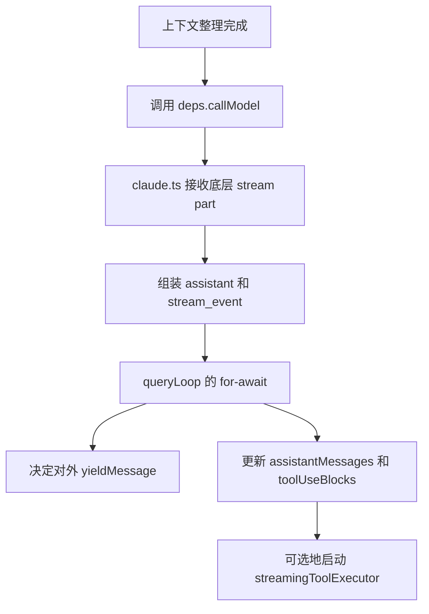

# 3. QueryLoop 流式阶段与消息组装

## 这一章解决什么问题
这一章把原来拆开的三件事合在一起讲：

1. `queryLoop()` 从哪里正式进入模型流式阶段
2. `for await (const message of deps.callModel(...))` 里每收到一条消息会改哪些变量
3. `claude.ts` 到底怎么把底层 stream part 组装成上层看到的 `assistant` / `stream_event`

如果把这三件事拆开看，你会一直在两个问题之间来回跳：

- `queryLoop` 为什么突然看见了一个完整 `assistant`
- `tool_use` 到底是什么时候开始真正推进工具执行时间线的

## 本章先给一个总心智模型
这一章最重要的结论先放前面：

> `queryLoop` 接到的不是 SDK 原始流事件，而是 `deps.callModel()` 这个 async generator 产出的“可消费消息流”；其中 `assistant` 已经是 `claude.ts` 组装过的内部消息，而 `tool_use` 的发现和流式工具执行也从这里正式开始。

## 执行流程（伪代码）
```text
完成 messagesForQuery 准备
    ↓
进入 deps.callModel(...)
    ↓
claude.ts 持续接收底层 stream part
    ↓
claude.ts 组装出 assistant / stream_event
    ↓
queryLoop for-await 逐条接收
    ↓
决定 outward 版本 yieldMessage
    ↓
决定是否 withheld
    ↓
assistant -> push assistantMessages
    ↓
提取 tool_use -> 更新 toolUseBlocks / needsFollowUp
    ↓
如果启用了 streamingToolExecutor -> 立刻 addTool
    ↓
顺手取 getCompletedResults()，可能在流中就看到 tool_result
```

## 在整体流程中的位置


## 第一层：从哪里正式进入流式阶段
真正的入口是这一段：

```653:660:src/query.ts
queryCheckpoint('query_api_loop_start')
try {
  while (attemptWithFallback) {
    attemptWithFallback = false
    try {
      let streamingFallbackOccured = false
      queryCheckpoint('query_api_streaming_start')
      for await (const message of deps.callModel({
```

这里其实有三层结构：

1. API 级别的 `try/catch`
2. 同一轮请求内的 fallback retry
3. 真正逐条收消息的 `for await`

最容易混淆的是第二层和外层 agent 主循环不是同一个东西：

- 外层 `while (true)`
  - 是多 turn 主循环
- 这里的 `while (attemptWithFallback)`
  - 是同一轮模型调用内的 fallback retry

## 第二层：`deps.callModel()` 到底向上产出什么
这里最关键的不是参数细节，而是它的返回类型：

> `deps.callModel()` 是一个 async generator，不是“一次性完整返回一条大结果”。

所以：

```ts
for await (const message of deps.callModel(...)) {
```

应该理解成：

> 每当模型调用层产出一条上层可消费的消息，`queryLoop` 就处理一条。

这些 `message` 并不都长一样，它可能是：

- `stream_event`
- `assistant`
- 某些合成错误消息

## 第三层：`claude.ts` 先把底层碎事件组装成上层消息
为什么 `queryLoop()` 能直接看到 `assistant.message.content` 这种看起来比较完整的结构？

因为在更底层，`claude.ts` 已经先做了一轮组装。

### `message_start`：初始化整条 message 的壳子
```1979:1994:src/services/api/claude.ts
case 'message_start': {
  partialMessage = part.message
  ttftMs = Date.now() - start
  usage = updateUsage(usage, part.message?.usage)
  break
}
```

这里先拿到的是：

- `partialMessage`
  - 整条消息的整体壳子
- `usage`
  - 初始 usage
- `ttftMs`
  - 首 token 时间

### `content_block_start` / `content_block_delta`：先建壳，再持续填内容
```1995:2038:src/services/api/claude.ts
case 'content_block_start':
  switch (part.content_block.type) {
    case 'tool_use':
      contentBlocks[part.index] = {
        ...part.content_block,
        input: '',
      }
      break
    case 'text':
      contentBlocks[part.index] = {
        ...part.content_block,
        text: '',
      }
      break
```

```2053:2161:src/services/api/claude.ts
case 'content_block_delta': {
  switch (delta.type) {
    case 'input_json_delta':
      contentBlock.input += delta.partial_json
      break
    case 'text_delta':
      contentBlock.text += delta.text
      break
    case 'thinking_delta':
      contentBlock.thinking += delta.thinking
      break
  }
}
```

这意味着：

- `tool_use.input`
  - 是通过多个 `input_json_delta` 拼起来的
- `text`
  - 是通过多个 `text_delta` 拼起来的
- `thinking`
  - 也是流式累积出来的

### `content_block_stop`：block 一完整，就立刻组装一条 `AssistantMessage`
```2192:2210:src/services/api/claude.ts
const m: AssistantMessage = {
  message: {
    ...partialMessage,
    content: normalizeContentFromAPI(
      [contentBlock] as BetaContentBlock[],
      tools,
      options.agentId,
    ),
  },
  requestId: streamRequestId ?? undefined,
  type: 'assistant',
  uuid: randomUUID(),
  timestamp: new Date().toISOString(),
}
newMessages.push(m)
yield m
```

这一步的意义是：

> 底层 block 一旦完整，`claude.ts` 就会立刻组装出一条项目内部的 `AssistantMessage`，然后向上 yield。

所以 `queryLoop()` 看到的 `assistant`：

- 不是 SDK 原始 part
- 而是这里组装好的内部消息

### `message_delta`：再把 usage / stop_reason 回写到已经 yield 过的消息上
```2213:2248:src/services/api/claude.ts
const lastMsg = newMessages.at(-1)
if (lastMsg) {
  lastMsg.message.usage = usage
  lastMsg.message.stop_reason = stopReason
}
```

这也是为什么你会感觉：

- `assistant` 已经先被 yield 出去了
- 但它的一些最终元信息又会在后面被补上

### 每个底层 `part` 也会被包成 `stream_event`
```2299:2303:src/services/api/claude.ts
yield {
  type: 'stream_event',
  event: part,
  ...(part.type === 'message_start' ? { ttftMs } : undefined),
}
```

所以 `queryLoop()` 的 `for await` 真的是在收“上层可消费消息流”，而不是只收 `assistant`。

## 第四层：进入 `queryLoop` 之后，先决定 outward 版本
进入 `for await` 后，先做的是：

```748:789:src/query.ts
let yieldMessage: typeof message = message
if (message.type === 'assistant') {
  let clonedContent: typeof message.message.content | undefined
  for (let i = 0; i < message.message.content.length; i++) {
    const block = message.message.content[i]!
    if (
      block.type === 'tool_use' &&
      typeof block.input === 'object' &&
      block.input !== null
    ) {
      const tool = findToolByName(
        toolUseContext.options.tools,
        block.name,
      )
      if (tool?.backfillObservableInput) {
        const originalInput = block.input as Record<string, unknown>
        const inputCopy = { ...originalInput }
        tool.backfillObservableInput(inputCopy)
        const addedFields = Object.keys(inputCopy).some(
          k => !(k in originalInput),
        )
        if (addedFields) {
          clonedContent ??= [...message.message.content]
          clonedContent[i] = { ...block, input: inputCopy }
        }
      }
    }
  }
  if (clonedContent) {
    yieldMessage = {
      ...message,
      message: { ...message.message, content: clonedContent },
    }
  }
}
```

这一段最重要的不是 clone 细节，而是先分出两层：

- `yieldMessage`
  - 对外看的 outward view
- `message`
  - 对内保存的原始 inward state

所以后面才会出现：

- `yield yieldMessage`
- `assistantMessages.push(message)`

## 第五层：`withheld` 决定当前消息先不先向外暴露
接下来代码会判断这条消息是否要先扣住：

```801:827:src/query.ts
let withheld = false
if (feature('CONTEXT_COLLAPSE')) {
  if (
    contextCollapse?.isWithheldPromptTooLong(
      message,
      isPromptTooLongMessage,
      querySource,
    )
  ) {
    withheld = true
  }
}
if (reactiveCompact?.isWithheldPromptTooLong(message)) {
  withheld = true
}
if (
  mediaRecoveryEnabled &&
  reactiveCompact?.isWithheldMediaSizeError(message)
) {
  withheld = true
}
if (isWithheldMaxOutputTokens(message)) {
  withheld = true
}
if (!withheld) {
  yield yieldMessage
}
```

关键认知是：

> `withheld` 不是“不要这条消息”，而是“先不要向外发，因为流结束后可能还能恢复”。

这点会直接影响下一章的无工具恢复路径。

## 第六层：内部状态始终吃原始 `message`
这一句是整个流式阶段最关键的状态边界：

```829:837:src/query.ts
if (message.type === 'assistant') {
  assistantMessages.push(message)

  const msgToolUseBlocks = message.message.content.filter(
    content => content.type === 'tool_use',
  ) as ToolUseBlock[]
  if (msgToolUseBlocks.length > 0) {
    toolUseBlocks.push(...msgToolUseBlocks)
    needsFollowUp = true
  }
}
```

它说明三件事：

1. `assistantMessages`
   - 收的是原始 `message`
2. `toolUseBlocks`
   - 收集本轮所有工具调用
3. `needsFollowUp`
   - 一旦出现任何 `tool_use`，就把流后分叉切到“需要继续”

所以 `needsFollowUp` 真正的含义不是“到了工具章节”，而是：

> 这个 turn 的后半段不能直接结束，必须继续处理工具相关动作。

## 第七层：tool 执行时间线其实已经从这里开始了
这正是原来文档最容易割裂的地方。

旧写法容易给人的感觉是：

- 流式阶段先结束
- 工具执行是下一章另一套故事

但真实代码不是这样。真实代码里，tool 时间线从这里就已经开始了：

```839:845:src/query.ts
if (
  streamingToolExecutor &&
  !toolUseContext.abortController.signal.aborted
) {
  for (const toolBlock of msgToolUseBlocks) {
    streamingToolExecutor.addTool(toolBlock, message)
  }
}
```

这一步不是“工具已经执行完了”，但它已经是：

- 发现 `tool_use`
- 把它加入执行器
- 允许流式工具执行器立刻开始调度

所以更准确的表述应该是：

> `tool_use` 的发现属于流式阶段，但它已经是工具执行时间线的前半段，而不是完全独立于工具执行的另一章。

## 第八层：为什么流中就可能看到一部分 `tool_result`
紧接着这段会顺手捞已经完成的工具结果：

```849:863:src/query.ts
if (
  streamingToolExecutor &&
  !toolUseContext.abortController.signal.aborted
) {
  for (const result of streamingToolExecutor.getCompletedResults()) {
    if (result.message) {
      yield result.message
      toolResults.push(
        ...normalizeMessagesForAPI(
          [result.message],
          toolUseContext.options.tools,
        ).filter(_ => _.type === 'user'),
      )
    }
  }
}
```

这段的真正意义是：

- 有些 tool 可能在模型还没完全说完时就已经跑完
- 那当前流式循环里就可以先把完成结果取出来

所以在同一个阶段里，你可能同时看到：

- `stream_event`
- `assistant`
- 已经完成的一部分 `tool_result`

这不是“章节跳跃”，而是代码本来就这样交错运行。

## 这一章最重要的变量，应该分三组看

### 1. 展示层变量
- `yieldMessage`
- `withheld`

### 2. 本轮内部累计状态
- `assistantMessages`
- `toolUseBlocks`
- `toolResults`

### 3. 流后分叉的控制开关
- `needsFollowUp`

## 一个完整的小例子
假设模型在这一轮里先输出一段文本，再发出一个 `Read`：

```text
message_start
content_block_start(text)
content_block_delta(text)
content_block_stop
content_block_start(tool_use)
content_block_delta(input_json)
content_block_stop
message_delta
message_stop
```

那么 `queryLoop()` 可能看到的是：

```text
stream_event(message_start)
assistant(text)
stream_event(content_block_stop)
assistant(tool_use)
  ↓
assistantMessages.push(message)
toolUseBlocks.push(tool_use)
needsFollowUp = true
streamingToolExecutor.addTool(tool_use, message)
  ↓
某次 getCompletedResults() 又拿到 tool_result
stream_event(message_delta)
stream_event(message_stop)
```

这就是为什么你调试时会感觉：

- 底层 stream 很碎
- 上层 `assistant` 已经比较完整
- tool 执行又像是“在流里插进来了”

其实三者是同一条时间线的不同抽象层。

## 本章总结
这一章最重要的结论不是某个局部 `if`，而是这句话：

> `queryLoop` 的流式阶段本身就同时承担了三件事：消费上层消息流、累计本轮状态、以及在发现 `tool_use` 时启动工具执行时间线的前半段。

下一章进入 turn 的后半段：

- `needsFollowUp === false` 时怎么恢复、续写或结束
- `needsFollowUp === true` 时怎么 drain 工具结果
- 两条路径最后又是怎么汇合到同一个 `next state`
