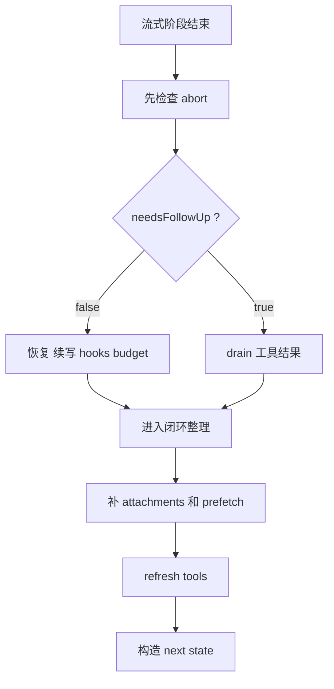

# 4. QueryLoop 流后分叉与下一轮闭环

## 这一章解决什么问题
这一章把原来拆成三篇的后半段合成一个整体，只解决一个核心问题：

> 流式阶段结束后，这个 turn 会怎么分叉，又怎么重新汇合成下一轮 `state`？

这是原来最容易割裂的地方，因为：

- 没有工具时，后面也不一定直接结束
- 有工具时，tool 执行并不是一条完全独立的新主线
- attachments / memory / skill prefetch / refreshTools 最后都会回流进下一轮

所以真正该看的不是“无工具篇”或“工具篇”，而是：

> 同一个 turn 的后半段，到底如何决定结束、继续、还是写回 `next state`。

## 本章先给一个总心智模型
流式阶段结束后，先问的不是“有没有工具章节”，而是这两个问题：

1. 有没有被中断？
2. `needsFollowUp` 是 `false` 还是 `true`？

然后就分成两条后半路径：

- `needsFollowUp === false`
  - 恢复 / 续写 / stop hooks / budget / 完成
- `needsFollowUp === true`
  - drain 工具更新 / normalize 成 `toolResults` / 更新 `toolUseContext`

但两条路径最后都要回到同一个闭环问题：

> 下一轮 `state.messages` 到底由哪三部分拼出来？

## 执行流程（伪代码）
```text
流式阶段结束
    ↓
先看 abort
    ↓
看 needsFollowUp
    ↓
┌───────────────────────────────┬───────────────────────────────┐
│ needsFollowUp === false       │ needsFollowUp === true        │
│                               │                               │
│ 恢复 / 续写 / hooks / budget  │ drain 工具结果 / 更新 context │
└───────────────────────────────┴───────────────────────────────┘
                    ↓
             补 attachments / prefetch
                    ↓
             refresh tools
                    ↓
          state = next，进入下一轮
```

## 在整体流程中的位置


## 第一层：流式结束后先看 abort
真正的流后入口，其实先不是“无工具 / 有工具”，而是中断检查：

```1017:1054:src/query.ts
if (toolUseContext.abortController.signal.aborted) {
  if (streamingToolExecutor) {
    for await (const update of streamingToolExecutor.getRemainingResults()) {
      if (update.message) {
        yield update.message
      }
    }
  } else {
    yield* yieldMissingToolResultBlocks(
      assistantMessages,
      'Interrupted by user',
    )
  }
  if (toolUseContext.abortController.signal.reason !== 'interrupt') {
    yield createUserInterruptionMessage({
      toolUse: false,
    })
  }
  return { reason: 'aborted_streaming' }
}
```

这里有两个关键点：

- 如果已经启用了 `streamingToolExecutor`
  - 就算流中断了，也要先把剩余工具结果 drain 一遍
- 如果没有 streaming executor
  - 也要补齐缺失的 `tool_result`

所以“中断处理”本身就已经横跨：

- 流式阶段
- 工具执行阶段
- 结果完整性

## 第二层：真正的后半段分叉点是 `needsFollowUp`
真正的分叉入口在这里：

```1064:1066:src/query.ts
if (!needsFollowUp) {
  const lastMessage = assistantMessages.at(-1)
```

所以 `needsFollowUp` 的真实语义是：

- `false`
  - 本轮没有后续工具动作，接下来判断是否恢复、续写或结束
- `true`
  - 本轮已经发现工具调用，接下来必须继续 drain 工具结果

它不是“章节标签”，而是 turn 后半段的分叉开关。

## 第三层：`needsFollowUp === false` 时，不是直接结束
这是原来最容易误判的地方。

### 1. 先看 withheld 错误能不能恢复
```1073:1171:src/query.ts
const isWithheld413 =
  lastMessage?.type === 'assistant' &&
  lastMessage.isApiErrorMessage &&
  isPromptTooLongMessage(lastMessage)

const isWithheldMedia =
  mediaRecoveryEnabled &&
  reactiveCompact?.isWithheldMediaSizeError(lastMessage)

if (
  feature('CONTEXT_COLLAPSE') &&
  contextCollapse &&
  state.transition?.reason !== 'collapse_drain_retry'
) {
  const drained = contextCollapse.recoverFromOverflow(
    messagesForQuery,
    querySource,
  )
  if (drained.committed > 0) {
    state = {
      messages: drained.messages,
      ...
      transition: {
        reason: 'collapse_drain_retry',
        committed: drained.committed,
      },
    }
    continue
  }
}
```

```1122:1168:src/query.ts
if ((isWithheld413 || isWithheldMedia) && reactiveCompact) {
  const compacted = await reactiveCompact.tryReactiveCompact(...)
  if (compacted) {
    const postCompactMessages = buildPostCompactMessages(compacted)
    for (const msg of postCompactMessages) {
      yield msg
    }
    state = {
      messages: postCompactMessages,
      ...
      transition: { reason: 'reactive_compact_retry' },
    }
    continue
  }
}
```

这段说明：

- `withheld` 的意义到这里才真正显出来
- 流里没向外暴露的错误，先留给恢复逻辑机会
- 恢复成功就 `state = next` 然后直接重来一轮

### 2. 再看 `max_output_tokens` 能不能续写
```1191:1254:src/query.ts
if (isWithheldMaxOutputTokens(lastMessage)) {
  if (
    capEnabled &&
    maxOutputTokensOverride === undefined &&
    !process.env.CLAUDE_CODE_MAX_OUTPUT_TOKENS
  ) {
    state = {
      messages: messagesForQuery,
      ...
      maxOutputTokensOverride: ESCALATED_MAX_TOKENS,
      transition: { reason: 'max_output_tokens_escalate' },
    }
    continue
  }

  if (maxOutputTokensRecoveryCount < MAX_OUTPUT_TOKENS_RECOVERY_LIMIT) {
    const recoveryMessage = createUserMessage({
      content:
        `Output token limit hit. Resume directly — no apology, no recap of what you were doing. ` +
        `Pick up mid-thought if that is where the cut happened. Break remaining work into smaller pieces.`,
      isMeta: true,
    })

    state = {
      messages: [
        ...messagesForQuery,
        ...assistantMessages,
        recoveryMessage,
      ],
      ...
      maxOutputTokensRecoveryCount: maxOutputTokensRecoveryCount + 1,
      transition: {
        reason: 'max_output_tokens_recovery',
        attempt: maxOutputTokensRecoveryCount + 1,
      },
    }
    continue
  }
}
```

这段非常关键，因为它说明：

- 没有 `tool_use`
- 也不代表模型这一轮真的“说完了”

有时只是：

- 回答被截断了
- 系统决定给模型再续一轮

### 3. 然后才是 stop hooks / token budget / 完成
```1270:1348:src/query.ts
const stopHookResult = yield* handleStopHooks(...)

if (stopHookResult.preventContinuation) {
  return { reason: 'stop_hook_prevented' }
}

if (stopHookResult.blockingErrors.length > 0) {
  state = {
    messages: [
      ...messagesForQuery,
      ...assistantMessages,
      ...stopHookResult.blockingErrors,
    ],
    ...
    transition: { reason: 'stop_hook_blocking' },
  }
  continue
}

if (feature('TOKEN_BUDGET')) {
  const decision = checkTokenBudget(...)
  if (decision.action === 'continue') {
    state = {
      messages: [
        ...messagesForQuery,
        ...assistantMessages,
        createUserMessage({
          content: decision.nudgeMessage,
          isMeta: true,
        }),
      ],
      ...
      transition: { reason: 'token_budget_continuation' },
    }
    continue
  }
}
```

所以 `needsFollowUp === false` 这条路径真正的心智模型不是：

```text
没工具 -> 结束
```

而是：

```text
没工具
  ↓
是否需要恢复
  ↓
是否需要续写
  ↓
是否被 stop hooks 或 token budget 推进下一轮
  ↓
都不需要，才完成
```

## 第四层：`needsFollowUp === true` 时，继续 drain 工具结果
工具路径真正的入口在这里：

```1363:1385:src/query.ts
let shouldPreventContinuation = false
let updatedToolUseContext = toolUseContext

queryCheckpoint('query_tool_execution_start')

const toolUpdates = streamingToolExecutor
  ? streamingToolExecutor.getRemainingResults()
  : runTools(toolUseBlocks, assistantMessages, canUseTool, toolUseContext)
```

这段要和上一章连起来看：

- 如果启用了 `streamingToolExecutor`
  - 流中已经开始执行过一部分 tool 了
  - 这里做的是把剩余结果 drain 完
- 如果没有 streaming executor
  - 那就现在才通过 `runTools(...)` 正式执行

所以更准确的说法是：

> 这里不是“工具执行突然开始”，而是 turn 的工具时间线进入后半段收尾。

### 消费 `toolUpdates`
```1386:1410:src/query.ts
for await (const update of toolUpdates) {
  if (update.message) {
    yield update.message

    if (
      update.message.type === 'attachment' &&
      update.message.attachment.type === 'hook_stopped_continuation'
    ) {
      shouldPreventContinuation = true
    }

    toolResults.push(
      ...normalizeMessagesForAPI(
        [update.message],
        toolUseContext.options.tools,
      ).filter(_ => _.type === 'user'),
    )
  }
  if (update.newContext) {
    updatedToolUseContext = {
      ...update.newContext,
      queryTracking,
    }
  }
}
```

这一段最该抓住的是两条线：

- 对外线
  - `yield update.message`
- 对内线
  - `toolResults.push(normalizeMessagesForAPI(...))`

所以工具结果不只是给 UI 看，它更重要的身份是：

> 它要被整理成下一轮模型还能继续理解的 API 消息。

### `toolResults` 在这一章里真正是什么意思
读到这里你就会发现，`toolResults` 这个变量名有点“偏窄”。

它后面的真实含义已经变成：

> 本轮准备回流到下一轮的补充结果集合。

因为后面进入它的，不只是真正的 `tool_result`。

## 第五层：无工具路径和有工具路径，最后会汇合到同一个闭环
这一层是原来最应该合并、但被拆得最散的部分。

### 1. attachments 也会进入 `toolResults`
```1583:1593:src/query.ts
for await (const attachment of getAttachmentMessages(
  null,
  updatedToolUseContext,
  null,
  queuedCommandsSnapshot,
  [...messagesForQuery, ...assistantMessages, ...toolResults],
  querySource,
)) {
  yield attachment
  toolResults.push(attachment)
}
```

这说明：

- attachment 不是“只给外部展示”的后处理
- 它也是下一轮上下文的一部分

### 2. memory / skill prefetch 也会进入 `toolResults`
```1602:1630:src/query.ts
if (
  pendingMemoryPrefetch &&
  pendingMemoryPrefetch.settledAt !== null &&
  pendingMemoryPrefetch.consumedOnIteration === -1
) {
  const memoryAttachments = filterDuplicateMemoryAttachments(
    await pendingMemoryPrefetch.promise,
    toolUseContext.readFileState,
  )
  for (const memAttachment of memoryAttachments) {
    const msg = createAttachmentMessage(memAttachment)
    yield msg
    toolResults.push(msg)
  }
}

if (skillPrefetch && pendingSkillPrefetch) {
  const skillAttachments =
    await skillPrefetch.collectSkillDiscoveryPrefetch(pendingSkillPrefetch)
  for (const att of skillAttachments) {
    const msg = createAttachmentMessage(att)
    yield msg
    toolResults.push(msg)
  }
}
```

所以到这一层，`toolResults` 的语义已经更明确了：

- 工具结果
- attachment
- memory 补充
- skill discovery 补充

只要是要回流到下一轮的新增上下文，最后都会汇进来。

### 3. `refreshTools()` 决定下一轮可用工具集
```1662:1674:src/query.ts
if (updatedToolUseContext.options.refreshTools) {
  const refreshedTools = updatedToolUseContext.options.refreshTools()
  if (refreshedTools !== updatedToolUseContext.options.tools) {
    updatedToolUseContext = {
      ...updatedToolUseContext,
      options: {
        ...updatedToolUseContext.options,
        tools: refreshedTools,
      },
    }
  }
}
```

这说明 turn 的闭环不仅要写回消息，还要写回：

- 更新后的 `toolUseContext`
- 以及下一轮真正可用的 tools

## 第六层：真正的闭环是 `state = next`
整个 queryLoop 的主循环闭环，真正收在这里：

```1718:1731:src/query.ts
const next: State = {
  messages: [...messagesForQuery, ...assistantMessages, ...toolResults],
  toolUseContext: toolUseContextWithQueryTracking,
  autoCompactTracking: tracking,
  turnCount: nextTurnCount,
  maxOutputTokensRecoveryCount: 0,
  hasAttemptedReactiveCompact: false,
  pendingToolUseSummary: nextPendingToolUseSummary,
  maxOutputTokensOverride: undefined,
  stopHookActive,
  transition: { reason: 'next_turn' },
}
state = next
```

这句里最重要的是这一行：

```ts
messages: [...messagesForQuery, ...assistantMessages, ...toolResults]
```

它定义了下一轮历史到底由哪三部分组成：

- `messagesForQuery`
  - 本轮请求视图
- `assistantMessages`
  - 本轮模型新增产物
- `toolResults`
  - 本轮所有要回流的补充结果

这也是为什么这三类变量必须放在同一个章节里讲，而不该拆散。

## 一个完整的 turn 后半段小例子
假设本轮整理完上下文后，模型流里做了两件事：

1. 输出一段文本
2. 发出一个 `ReadFile` 的 `tool_use`

那么 turn 后半段可能像这样推进：

```text
流式阶段结束
    ↓
needsFollowUp === true
    ↓
drain 剩余 toolUpdates
    ↓
yield 一条 tool_result
    ↓
normalize 后 push 进 toolResults
    ↓
再补 attachment / memory / skill prefetch
    ↓
messages: [...messagesForQuery, ...assistantMessages, ...toolResults]
    ↓
state = next
    ↓
进入下一轮 while
```

如果本轮没有 `tool_use`，路径会变成：

```text
流式阶段结束
    ↓
needsFollowUp === false
    ↓
先试恢复 / 续写 / hooks / budget
    ↓
需要继续就 state = next 并 continue
    ↓
都不需要才 return completed
```

所以“无工具”和“有工具”不是两套文档，而是同一条 turn 时间线的两条后半分支。

## 本章总结
这一章最重要的结论是：

> QueryLoop 的后半段不该按“无工具篇 / 工具篇 / 收尾篇”分别理解，而应该整体理解成：流式阶段结束后，turn 如何分叉、如何汇合、以及如何把本轮产物写回下一轮 `state`。

到这里，主线 4 章就闭环了：

1. 入口与状态
2. 请求前上下文整理
3. 流式阶段与消息组装
4. 流后分叉与下一轮闭环

接下来如果只想快速复习，建议读：

- `queryloop-deep-dive.md`
  - 一页速查
- `checkpoints/README.md`
  - 术语附录
