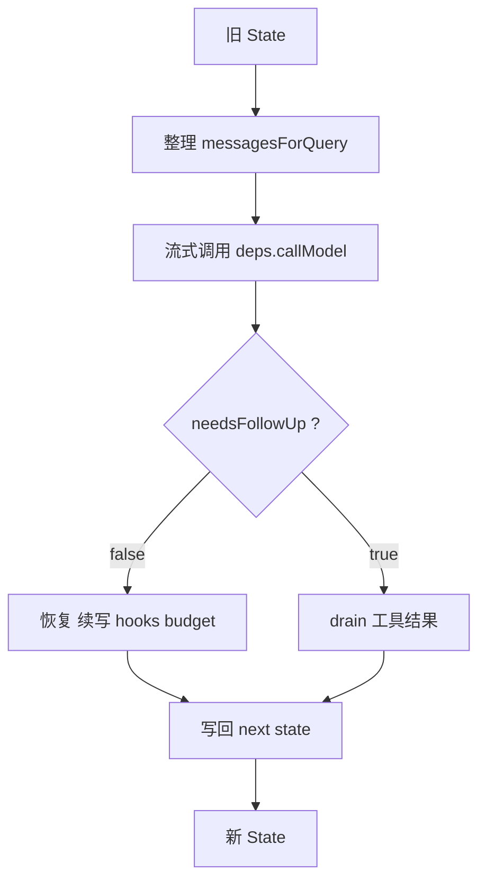

# QueryLoop 一页速查

这不是主线正文，而是一页速查。

如果你是第一次读，建议按主线四章看：

1. `1-queryloop-入口与状态.md`
2. `2-queryloop-请求前上下文整理.md`
3. `3-queryloop-流式阶段与消息组装.md`
4. `4-queryloop-流后分叉与下一轮闭环.md`

如果你已经看过正文，这一页用来快速回忆整体结构。

## 一句话总览
`queryLoop` 是一个状态机：每次循环推进一个 turn，把旧 `state` 整理成当前请求，消费模型流，处理工具或恢复分支，再把本轮产物写回新的 `state`。

## 一个 turn 只有四步
```text
1. 准备上下文
   从 state.messages 整理出 messagesForQuery

2. 调用模型
   流式消费 deps.callModel()

3. 处理 turn 后半段
   无工具 -> 恢复 / 续写 / hooks / budget
   有工具 -> drain 工具结果 / 更新 context

4. 写回 next state
   messagesForQuery + assistantMessages + toolResults
```

## 总体结构图


## 4 个最重要的变量

### `messagesForQuery`
本轮真正发给模型的请求视图，不等于 `state.messages`。

### `assistantMessages`
本轮模型新增产物。只有 `assistant` 类型会稳定进入这里。

### `toolResults`
本轮准备回流进下一轮的补充结果集合。后面装进去的不只是 `tool_result`，还可能有 attachment、memory、skill prefetch 等。

### `needsFollowUp`
turn 后半段的分叉开关：

- `false`
  - 没有后续工具动作，进入恢复 / 续写 / 结束判断
- `true`
  - 已经发现工具调用，继续 drain 工具更新

## 五种上下文整理手段
从轻到重看：

| 手段 | 做什么 |
|------|--------|
| `applyToolResultBudget` | 裁短单条超长 tool result |
| `snip` | 裁掉更早的历史消息 |
| `microcompact` | 清掉旧 tool result 内容但保留结构 |
| `collapse` | 做可回滚的结构化折叠 |
| `autocompact` | 调 summarizer 模型压缩历史 |

它们共同服务于同一个目标：

> 把 `state.messages` 整理成当前最合理的 `messagesForQuery`。

## 流式阶段最容易误解的边界

### `deps.callModel()` 产出的不是 SDK 原始 part
`queryLoop()` 看到的是上层可消费消息流，其中：

- `assistant`
  - 是 `claude.ts` 在 `content_block_stop` 时组装好的内部消息
- `stream_event`
  - 是底层流事件的包装

### tool 时间线从流中就开始了
一旦 `assistant` 里出现 `tool_use`：

- `toolUseBlocks.push(...)`
- `needsFollowUp = true`
- 如果启用了 `streamingToolExecutor`，会立刻 `addTool(...)`

所以工具执行不是流后突然开始的新故事，而是从流中发现 `tool_use` 时就已经启动了前半段。

## turn 后半段最容易误解的边界

### `!needsFollowUp` 不等于直接结束
后面还会继续判断：

- prompt too long / media 恢复
- `max_output_tokens` 续写
- stop hooks
- token budget

### `toolResults` 不只是工具结果
在进入下一轮前，后面还可能继续往里加：

- attachment
- memory attachment
- skill attachment

所以它最后更像“本轮要回流到下一轮的补充结果集合”。

## 真正的闭环
整个多 turn agent 真正闭环在这里：

```1718:1731:src/query.ts
const next: State = {
  messages: [...messagesForQuery, ...assistantMessages, ...toolResults],
  toolUseContext: toolUseContextWithQueryTracking,
  autoCompactTracking: tracking,
  turnCount: nextTurnCount,
  maxOutputTokensRecoveryCount: 0,
  hasAttemptedReactiveCompact: false,
  pendingToolUseSummary: nextPendingToolUseSummary,
  maxOutputTokensOverride: undefined,
  stopHookActive,
  transition: { reason: 'next_turn' },
}
state = next
```

只要记住这句，你就知道下一轮为什么能继续。

## 一句话总结
理解 queryLoop 的关键不是死记每个 if，而是记住这一句：

> 每个 turn 都是在把旧状态整理成当前请求，把本轮新增产物分类收集，再把它们写回新的 `state`。
