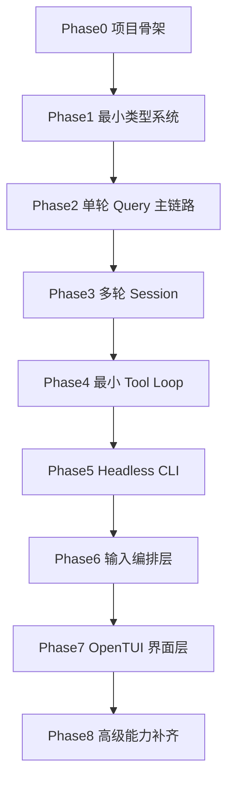

# ys-code ROADMAP

## 1. 项目定位

`ys-code` 的目标不是简单复制一份 `claude-code-haha`，也不是一开始就做完整替代品。

它的目标是：

1. 使用与 `claude-code-haha` 完全一致的框架与技术依赖。
2. 在项目内保留 `refer/claude-code-haha/` 作为随时可查的参考源码。
3. 先实现一个可运行、可理解、可调试的最小 Claude Code 核心。
4. 在此基础上，分阶段逼近 `claude-code-haha` 的真实能力与交互体验。

一句话概括：

`ys-code` 是一个“同技术栈、同问题域、分阶段逼近 Claude Code 的可控实现项目”。

---

## 2. 核心依赖

`ys-code` 的核心依赖分两部分：

### 2.1 内核层依赖

内核层依赖尽量与 `claude-code-haha` 保持一致，主要包括：

- Bun
- TypeScript
- 与模型调用相关的 SDK 和服务层依赖
- 与消息模型、工具系统、会话状态相关的主要依赖

这一层保持一致的目的，是为了让 `ys-code` 可以持续参考 `refer/claude-code-haha/` 的核心实现，而不会因为技术栈不同导致主链路出现额外偏差。

### 2.2 界面层依赖

界面层不再跟随 `claude-code-haha` 当前的 Ink 路线。

`ys-code` 的 TUI 计划改为使用 [OpenTUI](https://github.com/anomalyco/opentui)：

- `@opentui/core`
- `@opentui/react`
- Zig 构建链

这意味着：

- `claude-code-haha` 的 TUI 只作为参考，不作为目标实现
- `ys-code` 会复用 Claude Code 的内核思路，但采用新的 TUI 技术路线
- UI 架构和交互层可以重新设计，不需要追随当前 `REPL.tsx + Ink` 的表现形式

---

## 3. 项目结构建议

建议目录结构：

```text
ys-code/
  package.json
  tsconfig.json
  bunfig.toml
  preload.ts

  refer/
    claude-code-haha/

  src/
    entrypoints/
    screens/
    services/
    tools/
    types/
    utils/
    state/
    constants/

  debug/
  docs/
```

这个结构的核心目的不是“长得像”，而是职责划分要接近参考项目：

- `src/query.ts` 风格的核心循环
- `src/services/api/` 风格的模型服务层
- `src/utils/messages.ts` 风格的消息拼装层
- `src/tools/` 风格的工具系统
- `src/screens/` 下独立的交互入口，但界面技术路线改为 OpenTUI

---

## 4. 建设顺序总览



---

## 5. 分阶段 ROADMAP

## Phase 0：项目骨架与参考基线

### 目标

让 `ys-code` 成为一个“可启动、可对照、可持续演进”的空项目壳。

### 核心任务

1. 初始化 `ys-code` 项目。
2. 对齐 `package.json`、`tsconfig.json`、`bunfig.toml`、`preload.ts`。
3. 建立基础目录结构。
4. 引入 `refer/claude-code-haha/`。
5. 跑通一个最小 Bun + TypeScript 入口。

### 完成标准

- 依赖可以正常安装
- Bun 可以正常启动项目入口
- `refer/claude-code-haha/` 已可随时查阅
- 目录骨架已经稳定

### 这一阶段不要做

- 不做 query loop
- 不做 CLI
- 不做 TUI
- 不做工具系统

---

## Phase 1：最小类型系统

### 目标

先稳定 `ys-code` 的核心数据模型。

### 关键对象

- `Message`
- `UserMessage`
- `AssistantMessage`
- `SystemMessage`
- `ToolUse`
- `ToolResult`
- `SessionState`
- `QueryParams`
- `QueryState`

### 参考重点

- `refer/claude-code-haha/src/query.ts`
- `refer/claude-code-haha/src/types/`
- `refer/claude-code-haha/src/utils/messages.ts`

### 完成标准

- 类型足够支撑单轮 agent 主链路
- 类型结构不依赖 UI
- 后续 query / tool / session 逻辑都能建立在这些类型之上

### 这一阶段不要做

- 不做模型调用
- 不做流式输出
- 不做工具执行

---

## Phase 2：单轮 Query 主链路

### 目标

打通最小的一轮请求：

`user_input -> system prompt -> model stream -> assistant message`

### 核心任务

1. 建立最小模型调用入口。
2. 支持流式接收响应。
3. 聚合 stream event，组装出最终 assistant message。
4. 明确单轮 query 的输入和输出边界。

### 参考重点

- `refer/claude-code-haha/src/query.ts`
- `refer/claude-code-haha/src/services/api/claude.ts`
- `refer/claude-code-haha/src/utils/messages.ts`

### 完成标准

- 固定 prompt 能成功发起请求
- 能看到流式文本输出
- 能拿到最终 assistant message

### 这一阶段不要做

- 不做多轮上下文
- 不做工具调用
- 不做 TUI

---

## Phase 3：多轮 Session

### 目标

把“单轮 query”升级成“可持续对话的 session”。

### 核心问题

必须明确：

1. 谁是 session owner
2. 谁持有 `messages`
3. 谁负责每一轮 query 的输入输出拼接

### 核心任务

1. 设计一个唯一的 session owner。
2. 让第二轮 query 能真正吃到第一轮上下文。
3. 明确 turn 状态和 session 状态的边界。

### 参考重点

- `refer/claude-code-haha/src/query.ts`
- `refer/claude-code-haha/src/QueryEngine.ts`
- `refer/claude-code-haha/src/bootstrap/state.ts`

### 完成标准

- 两轮固定输入可以连续运行
- 第二轮输出明显依赖第一轮上下文
- session owner 已稳定

### 这一阶段不要做

- 不做复杂 session persistence
- 不做 transcript 存储
- 不做 background session

---

## Phase 4：最小 Tool Loop

### 目标

让 `ys-code` 从“纯聊天”变成“最小 agent”。

### 第一批建议工具

- `ReadFile`
- 一个最小的 shell/tool runner

### 主链路

`assistant tool_use -> tool execute -> tool_result -> follow-up query`

### 核心任务

1. 支持工具调用消息结构。
2. 让模型发出的 `tool_use` 能被系统识别。
3. 执行工具并生成 `tool_result`。
4. 把 `tool_result` 回送给下一次 query。

### 参考重点

- `refer/claude-code-haha/src/query.ts`
- `refer/claude-code-haha/src/tools/`
- `refer/claude-code-haha/src/utils/messages.ts`

### 完成标准

- 至少 1 到 2 个工具可以形成闭环
- 一轮中可以出现“模型 -> 工具 -> 模型”的 follow-up 流程

### 这一阶段不要做

- 不做全量工具
- 不做复杂权限系统
- 不做多代理

---

## Phase 5：Headless CLI

### 目标

在没有 TUI 的前提下，让 `ys-code` 变成一个真正可用的调试与交互容器。

### 建议顺序

1. 固定输入脚本
2. 两轮输入脚本
3. 最小 stdin loop

### 核心任务

1. 用 headless 方式驱动 query/session/tool loop。
2. 支持连续输入。
3. 在终端打印流式输出和最终消息。

### 参考重点

- `refer/claude-code-haha/debug/queryloop-spy.ts`
- `refer/claude-code-haha/src/cli/print.ts`
- `refer/claude-code-haha/src/utils/processUserInput/`

### 完成标准

- 可以在终端连续对话
- 可以看到流式文本
- 工具调用有基本可观测性

### 这一阶段不要做

- 不做 OpenTUI 界面
- 不做复杂输入框行为
- 不做快捷键系统

---

## Phase 6：输入编排层

### 目标

从“能跑 query”推进到“更接近真实 REPL 提交流程”。

### 核心任务

1. 引入 `processUserInput` 风格的输入处理。
2. 引入输入模式与附件概念。
3. 引入类似 `handlePromptSubmit` 的输入编排层。
4. 建立从输入到 query 的稳定转换链路。

### 参考重点

- `refer/claude-code-haha/src/utils/processUserInput/processUserInput.ts`
- `refer/claude-code-haha/src/utils/handlePromptSubmit.ts`
- `refer/claude-code-haha/src/screens/REPL.tsx`

### 完成标准

- 用户输入不再只是简单字符串
- 输入处理层和 query 层边界清晰
- 可以开始模拟真实 REPL 的提交语义

### 这一阶段不要做

- 不做完整 OpenTUI 界面
- 不做全部 slash command
- 不做远程模式

---

## Phase 7：OpenTUI 界面层

### 目标

在已有 headless 能力上，加一个基于 OpenTUI 的最小交互界面。

### 第一版只做

- `Messages`
- `PromptInput`
- 最小 loading / streaming 展示

### 核心任务

1. 建立最小 OpenTUI root。
2. 让输入框可提交。
3. 让消息列表可显示。
4. 让流式输出可见。

### 参考重点

- `refer/claude-code-haha/src/screens/REPL.tsx`
- `refer/claude-code-haha/src/components/PromptInput/`
- `refer/claude-code-haha/src/components/Messages.tsx`
- OpenTUI 的组件与 reconciler 文档

### 完成标准

- 有一个最小聊天 TUI
- 能输入
- 能看到流式消息
- 工具调用有最基本展示

### 这一阶段不要做

- 不做全量快捷键
- 不做 remote mode
- 不做 teammate mode
- 不做复杂 overlay

---

## Phase 8：高级能力补齐

### 目标

逐步逼近 `claude-code-haha` 的完整能力。

### 建议顺序

1. 权限系统
2. 文件历史 / session persistence
3. compaction
4. prompt context 注入
5. hooks
6. background / task / subagent
7. MCP
8. remote mode
9. analytics / diagnostics

### 说明

这一阶段都是增强项，不应该影响前面核心主链路的成立。

---

## 6. 参考阅读 / 迁移顺序

推荐按下面顺序理解参考项目，而不是按目录平铺：

1. `refer/claude-code-haha/src/query.ts`
2. `refer/claude-code-haha/src/services/api/claude.ts`
3. `refer/claude-code-haha/src/utils/messages.ts`
4. `refer/claude-code-haha/src/QueryEngine.ts`
5. `refer/claude-code-haha/src/utils/processUserInput/processUserInput.ts`
6. `refer/claude-code-haha/src/utils/handlePromptSubmit.ts`
7. `refer/claude-code-haha/src/screens/REPL.tsx`
8. `refer/claude-code-haha/src/tools/`
9. `refer/claude-code-haha/src/components/PromptInput/`
10. `refer/claude-code-haha/src/components/Messages.tsx`

这个顺序的逻辑是：

**先核心 loop，再 session，再输入编排，最后才是 UI。**

在 UI 层，`claude-code-haha` 只负责提供交互职责参考，不负责提供最终技术实现。

---

## 7. 里程碑设计

建议把 `ys-code` 的推进拆成下面这些里程碑：

- `M0`：项目骨架搭建完成
- `M1`：单轮文本 query 跑通
- `M2`：两轮 session 续上
- `M3`：最小 tool loop 成功
- `M4`：headless CLI 可连续对话
- `M5`：输入编排层成型
- `M6`：最小 OpenTUI 界面可用
- `M7`：高级能力逐步补齐

---

## 8. v0 建议范围

如果现在要定义 `ys-code v0`，建议只包含：

1. 项目骨架
2. 最小类型系统
3. 单轮 query
4. 多轮 session
5. 最小 tool loop
6. headless CLI

**v0 不做 OpenTUI 界面。**

原因是：

- 这 6 项已经足够形成一个真正可运行的“mini Claude Code 内核”
- headless 版本更容易 debug
- 可以先验证核心抽象是否正确

---

## 9. 实施建议

如果后面正式开始做 `ys-code`，最重要的实施建议有 5 条：

1. 永远先做 headless 成功版本，再做 UI。
2. 永远先做单轮，再做多轮，再做工具。
3. 永远明确谁是 session owner。
4. 不要在第一阶段复刻 `REPL.tsx` 的全部复杂度。
5. 把 `refer/claude-code-haha/` 当成源码字典，而不是必须原样搬运的目标。

---

## 10. 总结

`ys-code` 不应该被理解成“马上重做一个完整 Claude Code”，而应该被理解成：

**以 `claude-code-haha` 为参考底座，在相同技术栈上，先构建一个最小可运行、可理解、可 debug 的 agent 内核，再逐步向完整系统逼近。**

这条路线的关键不是“快”，而是：

- 每一层都清楚
- 每一阶段都能验收
- 每一步都能回到参考项目验证方向是否正确
